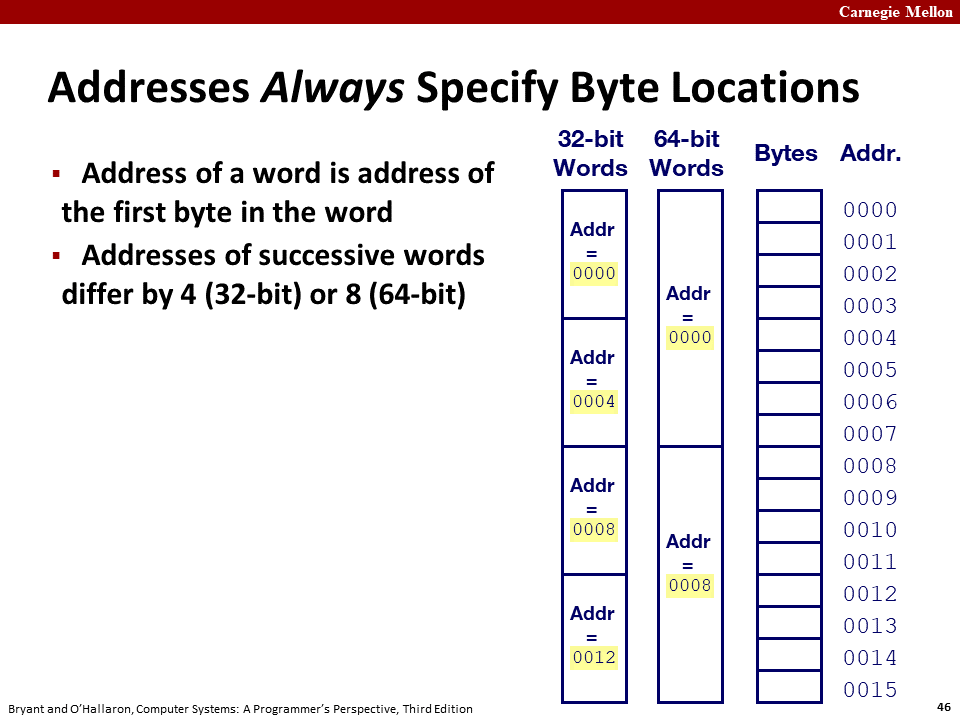
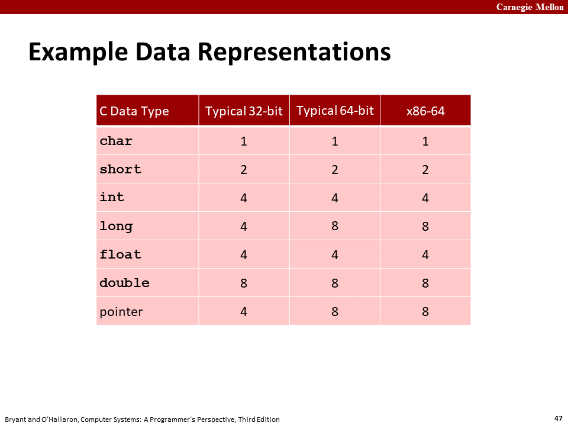

# L03_Bit_Byte_Integers_Cont
## 乘法
### 有符号乘法
对于w位的无符号整型数据x,y,范围在[$0,2^w-1$]内,他们的乘积在0<xy<$(2^w-1)^2$内.
这可能需要2w来进行表示,我们选用其低w位来表示,我们将这个数表示为x$*_w^uy$
即:
$$
x*_w^uy = (x*y)mod\space 2^w
$$

### 有符号乘法
对于有符号乘法来说,其本质和无符号乘法一样.
即其具有**等价性**
下面我将列表说明
|形式|x|y|x\*y|截断的x\*y|
|:-:|:-:|:-:|:-:|:-:|
|无符号|5:[101]|3:[011]|15:[001111]|7[111]|
|补码|-3:[101]|3:[011]|-9:[110111]|-1[111]|
|无符号|4:[100]|7:[111]|28:[011100]|4:[100]|
|补码|-4:[100]|-1:[111]|4:[000100]|4:[100]|

### 特殊的乘法
普通的乘法是加法的叠加,所以一个乘法运算需要消耗11-13个时钟周期,但是**乘除2的倍数则可以通过数据的位移完成**只需要1个时钟周期.
现代的乘法经过一系列的优化,只需要三个时钟周期来完成,不过一个时钟总比三个短.
#### 移位的分类
移位分为**逻辑移位和算术移位**
1. 逻辑移位:左移右侧补零,右移左侧补零
2. 算数移位:左移右侧补零,右移根据最左侧的数字进行补位,保留数据符号不变

```c
#include<stdio.h>
#include<stdint.h>

int main()
{
    uint8_t uint8_num = 0xff;
    int8_t  int8_pnum = 1;
    int8_t int8_nnum = -128;
    for(uint8_t i=0;i<8;i++)
    {
        printf("left for %dbits\n",i);
        printf("uint8_num = %x\n",(uint8_t)(uint8_num<<i));
        printf("int8_pnum = %d\n",(int8_t)(int8_pnum<<i));
        printf("int8_nnum = %d\n\n",(int8_t)(int8_nnum<<i));
    }
    for(uint8_t i=0;i<8;i++)
    {
        printf("right for %dbits\n",i);
        printf("uint8_num = %x\n",(uint8_t)(uint8_num>>i));
        printf("int8_pnum = %d\n",(int8_t)(int8_pnum>>i));
        printf("int8_nnum = %d\n\n",(int8_t)(int8_nnum>>i));
    }
}
```
```bash
left for 0bits
uint8_num = ff  
int8_pnum = 1   
int8_nnum = -128

left for 1bits  
uint8_num = fe  
int8_pnum = 2   
int8_nnum = 0   

left for 2bits  
uint8_num = fc
int8_pnum = 4
int8_nnum = 0

left for 3bits
uint8_num = f8
int8_pnum = 8
int8_nnum = 0

left for 4bits
uint8_num = f0
int8_pnum = 16
int8_nnum = 0

left for 5bits
uint8_num = e0
int8_pnum = 32
int8_nnum = 0

left for 6bits
uint8_num = c0
int8_pnum = 64
int8_nnum = 0

left for 7bits
uint8_num = 80
int8_pnum = -128
int8_nnum = 0

right for 0bits
uint8_num = ff
int8_pnum = 1
int8_nnum = -128

right for 1bits
uint8_num = 7f
int8_pnum = 0
int8_nnum = -64

right for 2bits
uint8_num = 3f
int8_pnum = 0
int8_nnum = -32

right for 3bits
uint8_num = 1f
int8_pnum = 0
int8_nnum = -16

right for 4bits
uint8_num = f
int8_pnum = 0
int8_nnum = -8

right for 5bits
uint8_num = 7
int8_pnum = 0
int8_nnum = -4

right for 6bits
uint8_num = 3
int8_pnum = 0
int8_nnum = -2

right for 7bits
uint8_num = 1
int8_pnum = 0
int8_nnum = -1
```
在程序中我们发现,程序对于无符号整型来说,执行的是逻辑移位,为对于有符号整型来说,采用的是算术移位.

### 数字取负
-x = ~x+1;
证明:
x+~x = 0x1111... = -1
-x = ~x+1

### 乘法重写(重要!)
在编译器中,乘法常常被优化为移位加上加法的形式,这样可以快速完成计算
对于**乘法x*K**,K为乘数,x为变量则可以对根据K的值进行转化
**例如:**
$$
\begin{align}
K =& 0x15\\
=& 0001 \space 0101\\
x*K =& x<<4+x<<2+x
\end{align}
$$
还有一种特殊情况:当K的第m位到第n位连续为1时,可以改写成下列公式
$$
\begin{align}
K=&0x78\\
= &0111\space 1000\\
x*K=&x<<7-x<<3
\end{align}
$$
由此可以推导出两个公式:
$$
\begin{align}
A:x*K=&x<<a_1+x<<a_2+...+x<<a_p\\
B:x*K=&x<<(n+1)-x<<m\\
当n为最大有&效位时还可以改写为:\\
B':x*K=&-x<<m
\end{align}
$$
p.s.位号从右到左进行排序,取值从0开始

## 除法
### C语言舍入标准
```c
#include <stdio.h>
#include <stdint.h>

int main()
{
    int8_t Nnum = -5;
    int8_t Pnum = 7;
    int8_t div  = 2;
    printf("Nnum = %d\nPnum = %d\ndiv  = %d\n",Nnum,Pnum,div);
    printf("Nnum/div = %d\n",Nnum/div);
    printf("Pnum/div = %d\n",Pnum/div);
    return 0;
}
```
```bash
PS C:\Users\31648\Desktop\markdown\CSAPP\program> ./L03_RoundVal.exe
Nnum = -5
Pnum = 7
div  = 2
Nnum/div = -2
Pnum/div = 3
```
由此可见,C语言遵循向零舍入,即正数向下舍入,负数向上舍入.

### 舍入规则
直接算术右移是行不通的,因为,这样会对负数也进行向下取整
所以我们引入**偏置**(biasing)的概念,来修正这种舍入

例如$x/2^k \space (x<0,0\le k <w)$时
**首先**,我们需要对x进行**补偿**:
$$
x' = x+(1<<k)-1
$$
**然后**进行**算术右移**
$$
x/2^k = (x+(1<<k)-1)>>k
$$
因此$(1<<k)-1$被称为偏量
|k|偏量|-12340+偏量|>>k(二进制)|十进制|$-12340/2^k$|
|:-:|:-:|:-:|:-:|:-:|:-:|
|0|0|$1100\space1111\space1100\space1100$|$1100\space1111\space1100\space1100$|-12340|-12340.0|
|1|1|$1100\space1111\space1100\space1101$|$1110\space0111\space1110\space0110$|-6170|-6170.0|
|4|15|$1100\space1111\space1101\space1011$|$1111\space1100\space1111\space1101$|-771|-771.25|
|8|255|$1101\space0000\space1100\space1011$|$1111\space1111\space1101\space0000$|-48|-48.203125|

对于全体有符号整数的除法,可以用这个**C表达式**来表示
$$
(x<0? x+(1<<k)-1 : x)>>k
$$


## 字长(WordSize)
字长是指计算机一次性处理和传输的最大数据
通常来说,大部分机器采用的是32位字长,也就是4byte,对于他们来说,他们能使用的最大内存地址为4GB($2^{32}$)
对于采用64位字长的机器来说它能使用的内存大小为18PB,由于$2^{64}$实在是一个太大的数据,所以,现代计算机规定的最大内存为$2^{47}$
**64位机最多使用47位地址**

### 内存对齐


对于32位字长的程序来说,每次占用4个字节,所以它的内存为4的倍数
对于64位字长的程序来说,每次占用8个字节,所以它的内存为8的倍数
编译器会努力使内存对齐,来获得更快的处理速度

```c
#include <stdio.h>

struct Aligned {
    int a;     // 4字节
    char b[3]; // 3字节
    char c;    // 1字节
    double d;  // 8字节
};

struct Unaligned {  //（未对齐）
    int a;          // 4字节
    double d;       // 8字节
    char c;         // 1字节
    char b[3];      // 3字节
};

struct Unaligned_4byte {
    int a;          // 4字节
    char b;         // 1字节
    int c;          // 4字节
};

int main() {
    printf("Size of Aligned: %d\n", sizeof(struct Aligned));
    printf("Size of Unaligned: %d\n", sizeof(struct Unaligned));
    printf("Size of Unaligned_4byte: %d\n", sizeof(struct Unaligned_4byte));
    return 0;
}
```

```bash
Size of Aligned: 16
Size of Unaligned: 24     
Size of Unaligned_4byte: 12
```

在C语言编译的过程中`Aligned`是对齐的结构体,大小等于其内部各个元素的和
`Unaligned`中,数据元素和Aligned是一样的,但是由于存在内存不对其,且出现了double(8byte)这一数据类型,所以要进行内存对齐,对齐到**8的倍数**
`Unaligned_4byte`中由于出现的最大的数据类型是int(4byte),所以只需要对齐到**4的倍数**.

**C语言变量类型在32位和64位之间的区别**


我们可以看到,32位和64位的不同之处在于long和pointer的大小不同
32位的指针只需要4byte就可以表达所有的地址而64位需要8byte

### Byte顺序
**Byte Order**分为**little-endian(小端)和big-endian(大端).**


