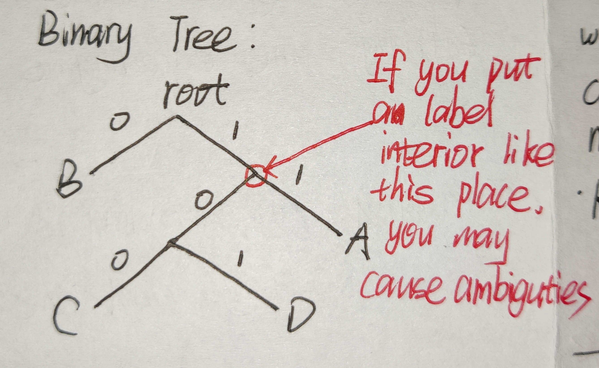
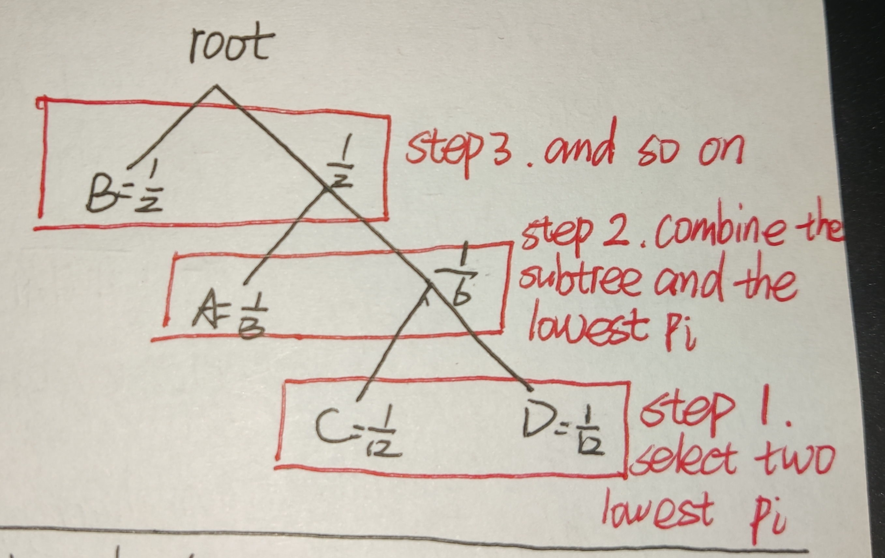

# L01 Basics of Information
## Shannon Equation

You are faced with n equal probable choices,And you receive data set a narrow it down to M choices.Thus the probality that the data would be sent is M*(1/N)

    你面临着n个等概率的选择，你接收到的数据集将其缩小到M个选择。因
    此，数据被发送的概率是M*(1/N)

### Here comes the formula:

***I(Data) = log<sub>2</sub> $\frac{N}{M}$***

## Entropy

In information theory , the entropy H(x) is the **average** amount of information contained in each piece of data received about the value of X.

    在信息论中，熵H(x)是接收到的每条数据中包含的关于x值的平均信息
    量。

### Here comes the formula
***$H(x) = E(I(x)) = \sum{p(i)*log_2 (\frac{1}{p_i})}$***

### Example
**X = {"A","B","C","D"}**
|$choice_i$|$p_i$|$log_2 \frac{1}{p_i}$|
|:----:|:------:|:--------:|
|"A"|$\frac{1}{3}$|1.58 bit|
|"B"|$\frac{1}{2}$|1 bit|
|"C"|$\frac{1}{12}$|3.58 bit|
|"D"|$\frac{1}{12}$|3.58 bit|

**$H(x) = \sum{p_i*log_2 \frac{1}{p_i}} =1.626 bits$**

Now we can find an encoding , the closer we can come with to Entropy , the better our encoding is.

So **Entropy** help us *evaluate* how good the encoding is.

    现在我们可以找到一种编码，我们越接近熵，我们的编码就越好。
    所以熵帮助我们评估编码的好坏。

1. if the average number of bits that is less than the **Entropy** , the information will be deep ***skepticism***. Because you can`t resolve the uncertainity.***So average number of bits > Entropy***
2. if the average number of bits that is great more than the Entropy , the encoding is useful but ineffecient. 
```
1.如果平均位数即小于熵，则该信息将受到深度怀疑。因为你无法解决不确定
性。所以平均比特数 > 熵
2.如果平均比特数大于熵，则编码是有用的但效率低下。
```
## Encoding
An encoding is an **unambiguous** mapping between bit strings and the set of possible data

    编码是位字符串和可能的数据集之间的明确映射

### example
**Encoding for each symbol**
|Index|"A"|"B"|"C"|"D"|Encoding for "ABBA"|
|:---:|:---:|:---:|:---:|:---:|:--------:|
|1|00|01|10|11|00010100|
|2|01|1|000|001|011101|
|3|0|1|10|11|0110|

Different Encodings have their advantages and disadvantages. Even cannot work properly.
1. For Index 1: this is a **visual** and **typical** encoding but it's long and may cause waste of memory.
2. For Index 2: this must be more tough to understand than Index 1. But it need **less memory** to store and can be decoded: "01" for "A", "1" for "B", "1" for "B",and "01" for "A".In another word, it's more **efficient**.
3. For Index 3: this encoding is ***False***. Because it may cause ***ambiguities***. "0110" can also be decoded as "ADA" or "ABC".
```
不同的编码有其优点和缺点。有些甚至不能正常工作。

对于索引1:这是一个视觉和典型的编码，但它很长，可能会导致内存浪费。

对于索引2:这一定比索引1更难理解。但它需要更少的内存来存储，并且可以
解码:“01”代表“A”，“1”代表“B”，“1”代表“B”，“01”代表“A”。换句话说，
它更有效率。

对于索引3:此编码为False。因为它可能会造成歧义。“0110”也可以解码为
“ADA”或“ABC”。
``` 
## Encoding as **Binary Trees**
To find an encoding, we can use "Encoding as **Binary Trees**"

It`s helpful to represent **an unambiguous encoding** as a binatree with the symbol to encoded as the leaves. The labels on the path from the root to the leaf give the encoding for that leaf.

    为了找到一个编码，我们可以使用“编码二叉树”
    将明确的编码表示为二叉树，并将符号编码为叶子，这很有帮助。从根节点到叶节点的路径上的标签给出了该叶节点的编码。
### example
***encoding: B = 0; A = 11; C = 100; D = 101;***



If you put a label interior like this place, you may cause ambiguties

    如果你像这样在里面放一个标签，可能会造成歧义
***

## Encoding Principle(variable-length encode)

***High possibility <--> short encoding***

***Low possibility <--> long encoding***
```
高可能性<- >短编码
低可能性<- >长编码
```
***
### example
|choice|$p_i$|encoding|
|:---:|:---:|:---:|
|"A"|$\frac{1}{3}$|11|
|"B"|$\frac{1}{2}$|0|
|"C"|$\frac{1}{12}$|100|
|"D"|$\frac{1}{12}$|101|

**Entropy: H(x) = 1.626 bit*

### Expect the length of encoding:

$Length = \frac{1}{3}*2+\frac{1}{2}*1+\frac{1}{12}*3*2 = 1.667 bit$

### Expect length of 1000 symbols:

*with fixed length: 2bit/symbol = 2000 bit*

*with variable-length code = 1667 bit*

### **Entropy** is the **mininum** of the length of encoding.
    熵是编码长度的最小值。

## Huffman`s Algorithm
1. Build subtree using 2 symbols with lowest $p_i$
2. At each step choose two symbols/subtrees with lowest $p_i$ and combine to form a new subtree.
3. Result: optimal tree built from the bottom-up.
```
霍夫曼算法
1. 使用2个p值最低的符号构建子树
2. 在每一步中选择两个p值最低的符号/子树并组合成一个新的子树。
3. 结果:自底向上构建最优树。
```
### example
$A = \frac{1}{3}$
$B = \frac{1}{2}$
$C = \frac{1}{12}$
$D = \frac{1}{12}$



## Detect Single-Bit Errors: ***Parity Check***

To check for a single-bit error(actually any odd number of errors), ***count the number of 1s*** in the received message and it`s **odd**. There has been an error.

    检测单比特错误:奇偶校验
    要检查一个单比特错误(实际上是任何奇数错误)，计算接收到的消息中的
    1的个数，它是奇数。有一个错误。

### example
0 1 1 0 0 1 0 1 0 0 1 1 -->original word with **parity**

0 1 1 0 0 **0** 0 1 0 0 1 1 -->it`s odd, errors happen.

0 1 1 0 **1 0** 0 1 0 0 1 1 ->Although it`s even, errors still happen.
```
0 1 1 0 0 1 0 0 1 1 -->具有奇偶校验的原始单词
0 1 0 0 0 0 0 0 1 1 -->这是奇数，错误发生了。
0 1 1 0 1 0 0 0 1 1 -->虽然是偶数，但还是会出错。
```