# L03 CMOS Technology
### MOS 管是什么?

MOS管全名MOSFET(金属半导体氧化物场效应晶体管),它有几个重要组成部分:
**栅极(gate),漏极(drain),源极(sourse)**

**其中NMOS的源极(sourse)接 $GND$ ; PMOS的源极(sourse)接 $V_{DD}$**

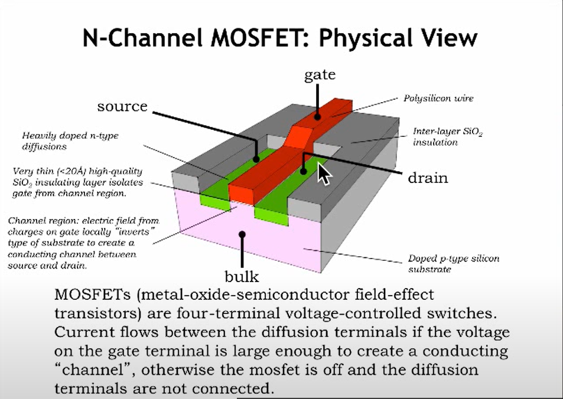

#### 这是一张NMOS的刨面图

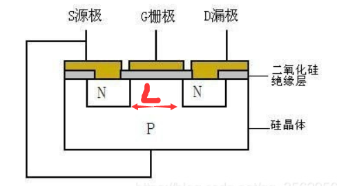

夹在两个N型半导体中间的称为L(沟道),沟道特别小(也许只有14纳米),当然越小越好,因为我们需要通过更大的电流.
栅极从上到下分别是**金属板,绝缘层,沟道**.其中绝缘层不导通,这样就构成了一个**电容器**(capacitor)

#### NMOS 截止&导通

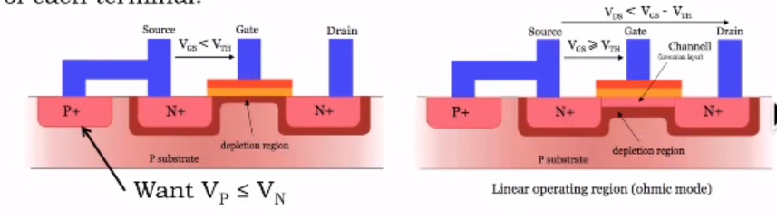

NMOS管的源极和漏极都由N型半导体组成,内含自由电子.而L沟道处则是由P型半导体构成,内含空穴.这样摆放让电路形成两个"尾尾相接"的二极管.**栅极不加电压时**,栅极-绝缘体-P型半导体构成的"电容器"没有效果,无论如何都不允许导通.
但是,当给**栅极加上电压时**,栅极所在的"电容器"将P型半导体里面为数不多的自由电子**吸引到沟道**,填满其中的空穴,使得两个N型半导体相连导通.此时,NMOS管导通.

设VGS = VG(gate) - VS(Source) 
VGS >  VTH(阈值)时导通
VGS <  VTH(阈值)时截止
#### $I_{DS}$和$V_{DS}$之间的关系,规律

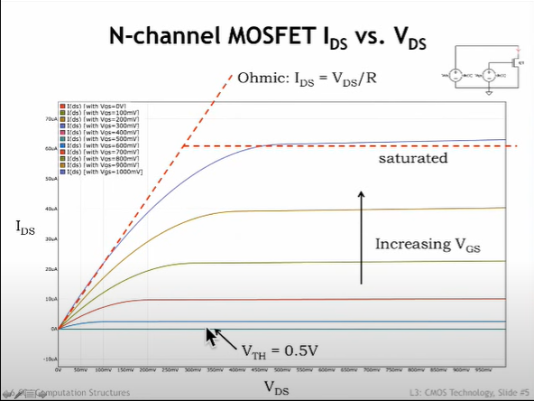

可以看到当$V_{GS}$ < $V_{TH}(阈值)$时,MOS管截止

当$V_{GS}$不变时,$I_{DS}$随$V_{DS}$的增大而增大直到最后趋近于饱和.
当$V_{GS}$增大,$I_{DS}$饱和的值同样在增大
($V_{GS}$总会比$V_{DS}$大一些)

#### 两种MOSFET管

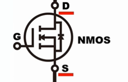

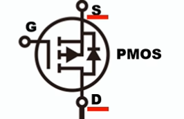

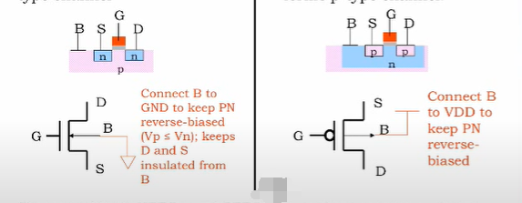

PFET和NFET相反,它的栅极需要接低电平才能使DS导通.就像NPN和PNP.

## 两种CMOS管使用规范
--------------------------
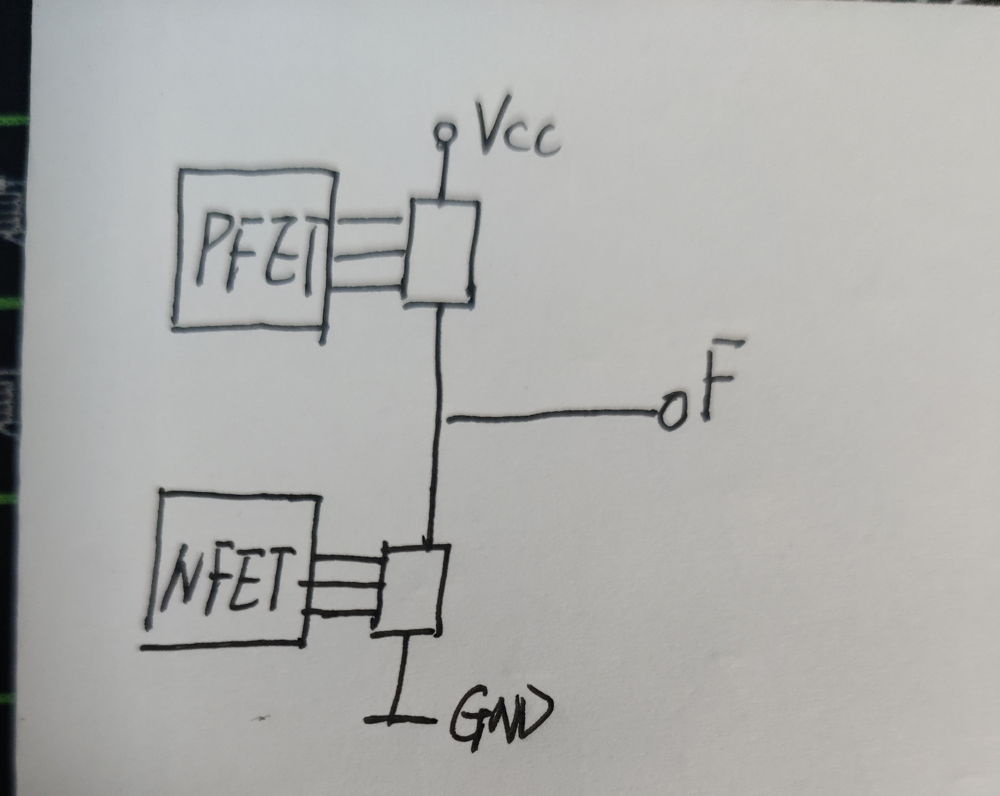

- 一个设备需要输出"1"时,必须用**P型CMOS管**进行上拉;需要输出"0"时,必须用**N型CMOS管**下拉.

#### 样例:最简单的逆变器

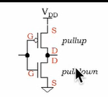

CMOS是具有十分优秀的**噪声容限**(noise margin)的一种元器件

------------------------

### CMOS与逻辑门

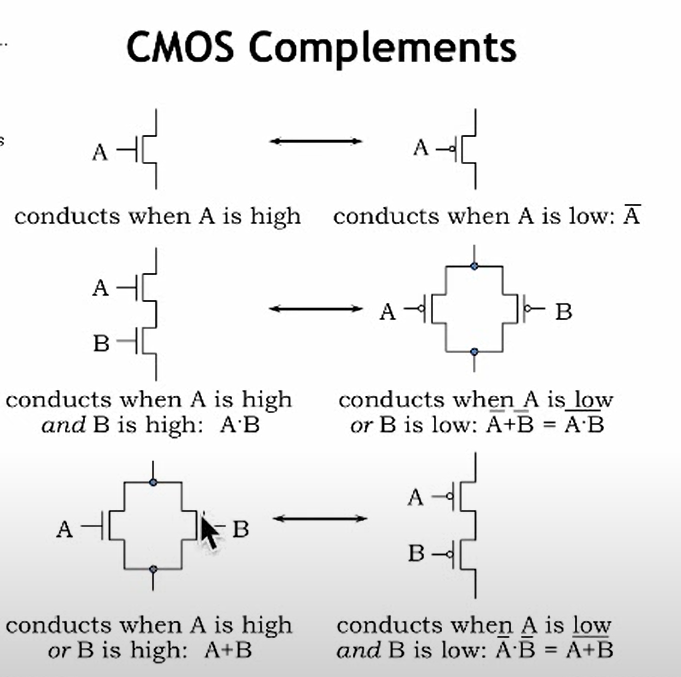

利用PFET和NFET两种MOS管的组合也可以完成**各种逻辑门**的搭建.并且比起三极管,MOS管的功耗更小.

### CMOS 的特性
#### 1. 传播延迟

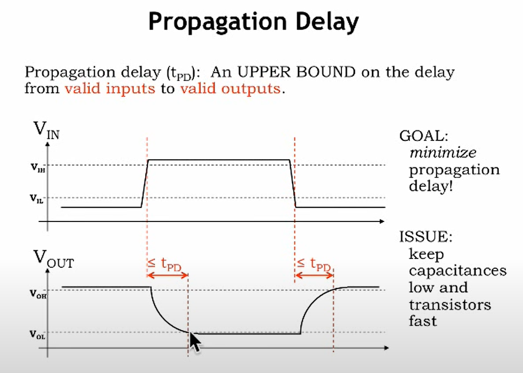

在图中,我们可以看到,当输入改变时,输出不会瞬间改变,而是需要一些时间才能发生变动. 于是**我们把时间 $t_{PD}$ 称作传播延迟**
#### 2. 污染延迟

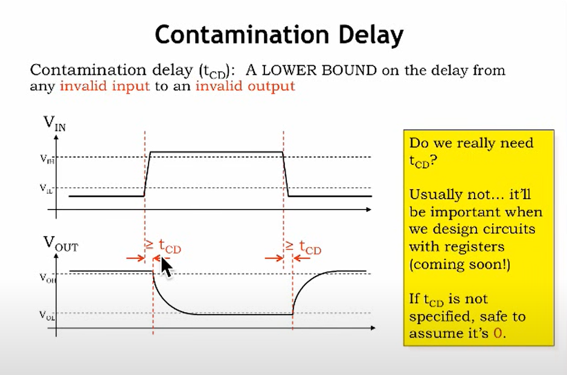

仔细看,在$V_{IL}$到$V_{IH}$切换的过程中输入进入"禁区",而与此同时,我们可以发现$V_{OUT}$并没有发生改变. 这就是污染延迟,我们把这段时间命名为$t_{CD}$. 通常认为$t_{CD}$ = 0,虽然它不等于.
#### #计算$t_{PD}$ & $t_{CD}$

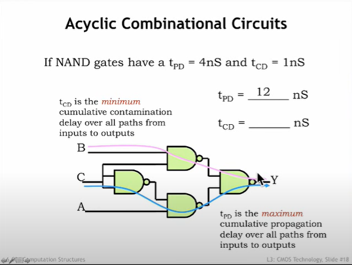

1. 计算$t_{PD}$的总时长时,需要找到最长路径,算出$t_{PD}$之和,题目中经过了三个NAND所以$t_{PD}$ = 12
2. 计算$t_{CD}$则需要找到最短路径,这里是两个NAND所以$t_{CD}$ = 2

-----------------

## 附:
### 为什么NMOS只能下拉;而PMOS只能上拉

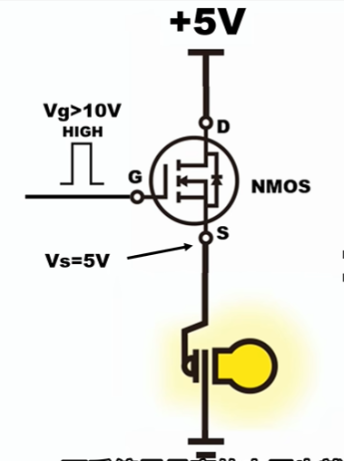

如果我们使用NMOS作为上拉驱动这个"小灯泡".那么在栅极(Gate)给高电平的一瞬间NMOS导通,电阻趋近于0,那么源极(Source)承接了$V_{DD}$达到了高电平.那么此刻NMOS要想继续保持导通的状态,就必须满足:
$V_{GS}$ > $V_{TH}$
也就是 $V_G$ > $V_S$ + $V_{TH}$
假设 $V_{TH}$ = 2V
那么 $V_G$ > 7V
而我们之前给$V_G$的高电平也就5V左右($V_{DD}$)不能使NMOS导通
但是截止之后,$V_S$ = $GND$ 我们又满足了一开始的条件于是...我们进入了死循环,这也就是为什么不能用NMOS上拉的原因了.

### $t_{PD}与t_{CD}的定义阐释$
**电路图**
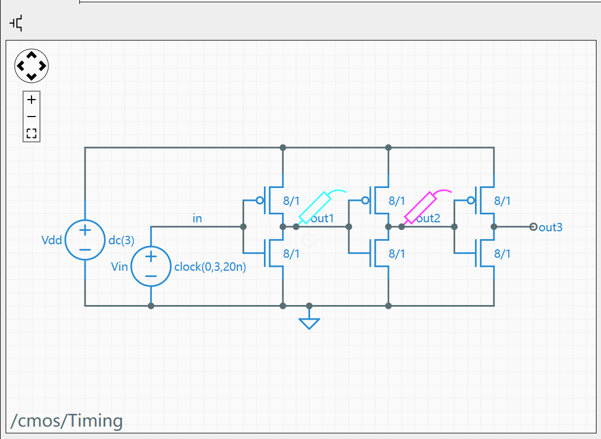
在图中
$$
V_{OL} = 0.3V \\
V_{OH} = 2.7V \\
V_{IL} = 1.1V \\
V_{IH} = 1.8V
$$

#### $t_{PD}$的定义阐释

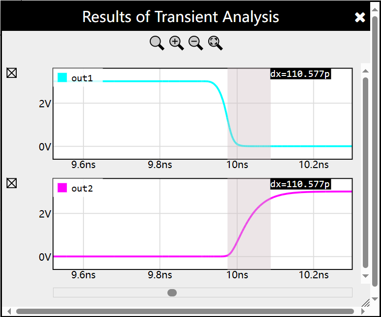

$t_{PD}$代表的是**有效输入到有效输出的时间**
即从$out1:V_{IL}$到$out2:V_{OH}$的时间

#### $t_{CD}的定义阐释$
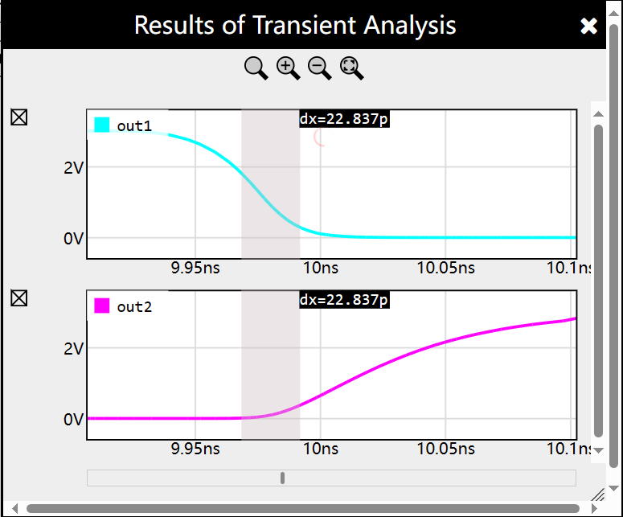

$t_{PD}$代表的是**无效输入到有效输入的时间**
即从$out1:V_{IH}$到$out1:V_{IL}$的时间

