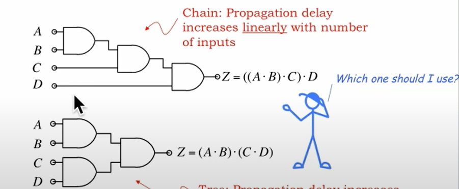
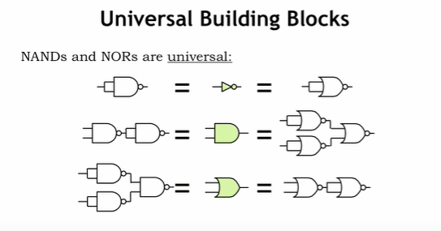
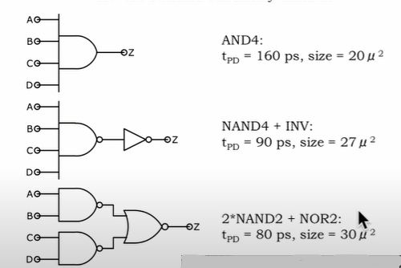
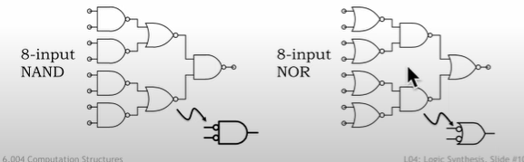
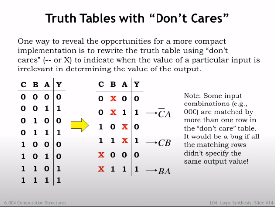
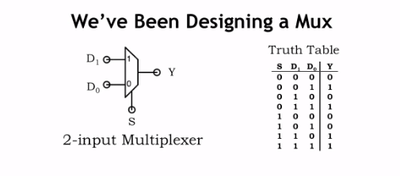
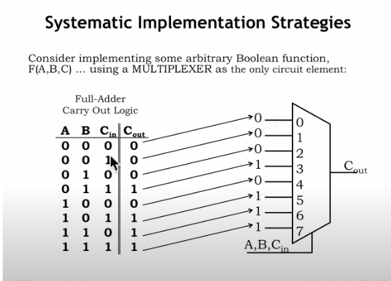
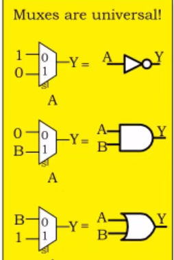

# L04_Synthesis_of_Combinational_Logic

## 布尔方程式
### 布尔方程式与真值表
#### 布尔方程与真值表的相互转化
|index|"A"|"B"|"C"|F|
|:--:|:---:|:---:|:---:|:---:|
|i|0|0|0|1|
|ii|1|0|0|0|
|iii|0|1|0|0|
|iv|0|0|1|0|
|v|1|0|1|1|
|vi|1|1|0|0|
|vii|0|1|1|1|
|viii|1|1|1|1|

1. 我们把输出为 1 的所有行拿出来

即:
|index|"A"|"B"|"C"|F|
|:--:|:---:|:---:|:---:|:---:|
|i|0|0|0|1|
|v|1|0|1|1|
|vii|0|1|1|1|
|viii|1|1|1|1|

2. **把输出为"1"时**,输出F 与 输入A,B,C的关系表示出来

第"i"行: $F = \overline{ABC}$
第"v"行: $F = A\overline{B}C$
第"vii"行: $F = \overline{A}BC$
第"viii"行: $F = ABC$

3. 最后所有式子汇总到一起,构成表达式

$F = \overline{ABC} + A\overline{B}C + \overline{A}BC + ABC$

**这就是真值表到表达式的转变**

#### 表达式到真值表的转化
自己慢慢转吧,没什么好的办法

-----------------------------

## 门与逻辑电路
### 拼接门时的注意事项

我们可能存在多种拼接方式,做成一个多输入的与门,如上图,我们有两种拼接方式,且这两种模式使用的与门数量相同.
哪一种方式好呢?
**无法判断** , 因为以第一种方式拼接成的多输入与门其**传播延迟**随输入数量的增加而增加，输入数量与传播延迟呈**线性关系**。但是它**不要求输入的数据同时到达**。
而第二种输入数量与传播延迟，**具有"$log_2 n$"关系**,传播延迟对电路的影响小。但是它**要求数据同时到达**。

### 与非/或非门可以转化为任意的门

#### NAND
与门：$AB = \overline{(\overline{AB}})$
或门：$A+B = \overline{(\overline{A} + \overline{B})}$
...

#### NOR
与门：$AB = \overline{(\overline{A} + \overline{B})}$
或门：\(A+B = \overline{(\overline{A+B})}\)
...

### 逻辑门的组合
#### 多输入与门的不同组合方式

1. AND4:
   这是由3个与门搭建的4输入与门，由于NAND,NOR,INV属于基本门，CMOS电路对NAND和NOR的处理效率最快（CMOS电路以逆变器为基础）,所以只用与门速度最慢，但是体积最小。

2. NAND4 + INV
   这里用了与非门和一个非门做电路，传播延迟比1.小，但是需要布线，体积比AND4大。

3. 2NAND + NOR
   用了两个与非门和一个或非门。传播延迟最小，但是体积最大。

#### 多输入与非/或非门的组合通用公式

与非门：第一排与非门，第二排或非门，第三排与非门……
或非门：第一排或非门，第二排与非门，第三排或非门……

### 摩根定律(morgan law)
1. $\overline{A*B} = \overline{A} + \overline{B}$
2. $\overline{A+B} = \overline{A} * \overline{B}$

### 简化逻辑门

#### 重写真值表

**关注那些可以被忽略的变量**

如图，不管B怎样，都不能影响数值随AC的变化，此时我们就可以写出如$\overline{C}A$这样的表达式，这就相当于完成了一次简化。

## 多路复用器
多路复用器（Multiplexer，简称MUX）是一种数字逻辑电路设备，用于在多个模拟或数字输入信号中选择一个，并根据控制信号将选定的输入信号传输到单个输出线路。它的功能可以类比为一种高速切换装置，能够在多个信号源之间迅速切换，从而实现在单个信道上传输多个信号的目的。

### 多路复用器的输入和控制

如图所示，当存在N个控制输入时，可以从$2^N$ 个数据中选择输出其中一个数据。（有点像138译码器）

### 多路复用器与逻辑门

如图

使用多路选择器（MUX）构建逻辑门相比于传统的互补金属氧化物半导体（CMOS）逻辑门有一些独特的优缺点：

#### 使用MUX构建逻辑门的优点：

1. **可重构性**：多路选择器可以通过改变控制信号来实现不同的逻辑功能，这使得基于MUX的逻辑门在设计灵活性和可重构性方面优于固定功能的CMOS逻辑门。

2. **设计简化**：使用多路选择器可以简化复杂逻辑函数的设计，因为可以只使用一个MUX来代替多个逻辑门。

3. **减少组件数量**：在某些情况下，使用多路选择器可以减少所需的总器件数量，这可能会减少印刷电路板（PCB）的尺寸和成本。

4. **速度优势**：在某些情况下，基于MUX的设计可以有速度上的优势，因为它们可能会有较少的逻辑级别，从而减少传播延迟。

#### 使用MUX构建逻辑门的缺点：

1. **功耗**：多路选择器通常需要更多的控制线，并且在一些设计中可能会消耗比传统CMOS逻辑门更多的功耗。

2. **复杂性**：虽然MUX可以减少器件数量，但控制逻辑可能会变得复杂，特别是在需要实现的逻辑功能比较多的时候。

3. **面积占用**：单个多路选择器可能会比单个逻辑门占用更多的芯片面积，尤其是在需要较多输入的情况下。

4. **速度限制**：虽然减少了逻辑级别，但多路选择器的内部延迟可能会比优化的CMOS逻辑门更高，特别是在高频应用中。

5. **灵活性与成本的权衡**：虽然多路选择器提供了更高的灵活性，但在大规模生产时，专用的CMOS逻辑门可能会更具成本效益。

在实际应用中，选择使用多路选择器还是CMOS逻辑门需要根据具体的设计要求、成本预算和功耗限制来综合考虑。例如，在ASIC（Application-Specific Integrated Circuit）或FPGA（Field-Programmable Gate Array）设计中，多路选择器可能更受欢迎，因为它们可以提供灵活的逻辑配置选项。而在专注于功耗和成本的消费电子产品中，传统的CMOS逻辑门可能是更佳选择。