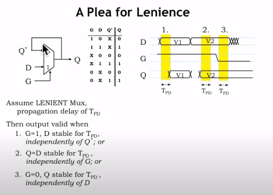
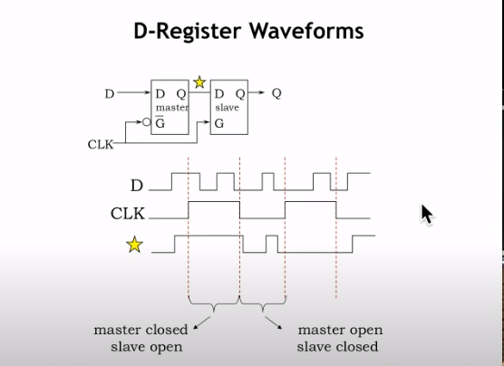

# L05_Sequential_Logic

## 数据存储的方式
______________________________
### 电容存储数据

#### 优点
1. 电压控制，基本不耗电
2. 适合做大规模集成电路

#### 缺点
1. 电容电荷泄漏，不能长久的保存数据
2. 不稳定，容易受到噪音（noise）干扰
______________________________

### 反哺电路存储数据（D-Latch）

#### 原理
G置**低电平**时，Q为D01的数据，这样Q完成了**自锁**，Q的数据就被保存下来了。
G置**高电平**时，Q输出D（Data），这样就把数据传进去了，此时，G再置低，数据就被保存下来了。

#### 问题与改进

**传播延迟**(Propagation Delay)对MUX输出影响很大，当G的电平发生改变，MUX需要时间来应对，但是，在这段时间里（\(t_{PD}\)）Q应该输出哪个输入端口呢？

所以我们采用**宽大多路复用器**连接电路（Lenient MUX）

Lenient MUX有一个特点：尽量让电路稳定，当G跳变后的$t_{PD}$内，使输出无效，那就不能改变$Q'$的电位，让数据得以保存。

#### 数据存储过程

在数据存储的过程中,我们称D(Data)需要稳定的时间为\(t_{stable}\)
其中我们设\(t_{stable} = t_{setup}+t_{keep}+t_{hold}\)
如图\(t_{setup}=2t_{PD}\):
第一段\(t_{PD}\)中,D(Data)发生改变,输出响应;
第二段\(t_{PD}\)中,\(Q'\)接受\(Q(Output)\)并响应
\(t_{keep}\)时,G由高置低,此时\(Q'\)和D(Data)的电位保持一致
\(t_{hold}\)时,电路还需要经过一个\(t_{PD}\)才能让$Q'$的值传到\(Q(Output)\)
在\(t_{stable}\)这段时间内,D(Data)的数据不能发生改变,之后,\(Q\),\(Q'\)的值不受D(Data)的干扰

#### 缺点
1. 运用过程中容易受到外部电路的干扰

在这个回路中,一旦G发生改变,D(Data)的数据马上传给了组合逻辑(Combinational Logic),这样组合逻辑电路又更改了D(Data)的电平,不符合"D在$t_{stable}$保持稳定"这一原则,所以下面介绍D寄存器(D-register),解决这一问题
______________________________

### D寄存器(D-register)

D寄存器是D-Latch的加强,由两个MUX构成

#### 原理

时钟上升沿时,master的G为0，master的$Q$保持不变,slave的$G$为1,$Q$输出D,此时把存储的数据读取出来了.
时钟下降沿时,master的G为1，此时，master的$Q$为D,可以传入数据,slave的G为0,Q保持不变,此时我们把数据传入,并且不受原来电路的影响。

#### D寄存器时序图

1. 对于$Q$来说,当时钟进入上升沿时,$Q$首先要经过一个**污染延迟**(Contamination Delay) \(t_{CD}\) 后$Q$电平开始发生改变，如果此时D发生改变，将造成Q的不稳定。
2. 然后必须经过一个**传播延迟**(Propagation Delay)$Q$的电平完全稳定($t_{PD}$为稳定所需的最大时间)
3. 对于D(Data)来说，需要在$t_{SETUP}+t_{HOLD}$这段时间保持稳定，这样才能把数据存储进去。
-------------------------
## 单时钟同步电路

### 设计原则
1. 不构成闭环回路
2. 电路中所有使用时钟的元器件**共用同一个时钟**
3. 只使用**上升沿前**寄存器中的数据
4. 每个时钟持续和间隔的周期必须**大于**\(t_{CD}+t_{SETUP}\)（污染延迟和初始化时间）
5. 在噪声停止后才能保存状态。

### 单时钟同步电路时序图

这张图展示的是在单时钟系统中的定时分析，通常用于数字电路设计，特别是在寄存器之间的信号传递中。图中的主要元素是两个D型触发器（reg1和reg2），它们通过某些逻辑（L）相连，以及它们之间的时序关系。

**上半部分**是系统的简化框图，说明了信号在两个触发器（reg1和reg2）之间是如何流动的。D型触发器的输出（Q_reg1）经过一些组合逻辑（L）处理后，成为下一个触发器（reg2）的输入（D）。

**下半部分**是这些组件的时序图。它展示了时钟信号（CLK）和数据信号（Q_reg1和D）的关系以及它们的关键时序参数：

1. **t1**: 第一个触发器的输出（Q_reg1）到组合逻辑（L）的输出（D_reg2）所需的总时间。这包括：
   - 第一个触发器的传播延迟（\( t_{PD,reg1} \)）
   - 组合逻辑的传播延迟（\( t_{PD,L} \)）
   - 第二个触发器的保持时间（\( t_{HOLD,reg2} \)）

   这个时间必须小于或等于两个连续时钟上升沿之间的时间，以确保数据能在第二个触发器锁存前稳定到达。

2. **t2**: 描述了从一个时钟周期的起始（CLK上升沿）到数据被第二个触发器锁存之前必须稳定的时间。这包括：
   - 第一个触发器的传播延迟（\( t_{PD,reg1} \)）
   - 组合逻辑的传播延迟（\( t_{PD,L} \)）
   - 第二个触发器的建立时间（\( t_{SETUP,reg2} \)）

   为了确保数据稳定并能被第二个触发器正确锁存，这个时间必须小于或等于时钟周期（\( t_{CLK} \)）。

时序要求确保了数据从一个寄存器正确流向另一个寄存器，且不会因为时钟的不同步导致数据丢失或错误。设计师需要确保所有信号的建立和保持时间要求都得到满足，以保证电路的正确操作。