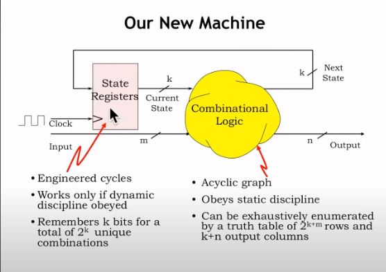
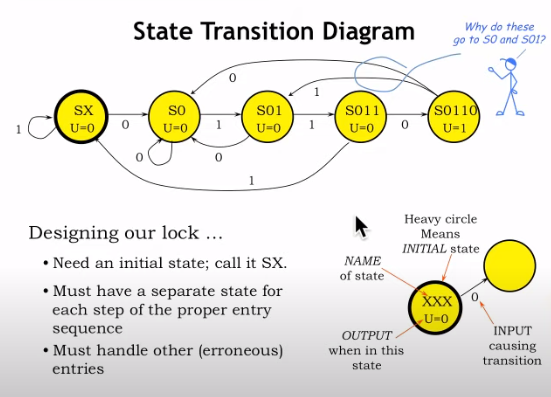

# L06_Finite_State_Machines(有限状态机)

## 有限状态机介绍
### 为什么我们要引入有限状态机

引入有限状态机可以帮助我们更好地设计顺序逻辑系统(sequential logic system)。

如图，**State Registers**用来记录当前状态，里面存储了**k**个数据，这说明它可以表示$2^k$个状态。
加上State Register中的数据，那么一共有k+m个输入，k+n个输出，那么我们的真值表就有$2^{k+m}$行，k+n列。

### 有限状态机的输出和输入
#### 输入
- k个字节表示**状态**
- m个**输入**数据

**这是输入**($k+m$行，$2^{k+m}$列)
|$k_{i1}$|$k_{i2}$|...|$k_{ik}$|$m_1$|$m_2$|...|$m_{m}$|
|:---:|:---:|:---:|:---:|:---:|:---:|:---:|:---:|
|0|0|...|0|0|0|...|0|
|0|0|...|0|0|0|...|1|
|...|...|...|...|...|...|...|...|
|1|1|...|1|1|1|...|1|

#### 输出
- k个字节表示**下一个状态**
- n个**输出**数据

**这是输出**($k+n$行，$2^{k+m}$列)
|$k_{o1}$|$k_{o2}$|...|$k_{ok}$|$n_1$|$n_2$|...|$n_{n}$|
|:---:|:---:|:---:|:---:|:---:|:---:|:---:|:---:|
|0|0|...|0|0|0|...|0|
|0|0|...|0|0|0|...|1|
|...|...|...|...|...|...|...|...|
|1|1|...|1|1|1|...|1|

$p.s$输入输出拼到一起就是一张完整的真值表了

---

## 状态机功能模块

### 锁：指示状态/安全控制

在有限状态机（FSM）中，"锁"通常是一个抽象的概念，指的是一个**安全或控制机制**，它在特定条件下更改状态，从而启用或禁用某些功能。在这个特定的情况下，我们可以定义"锁"如下：

**锁**：在我们的有限状态机模型中，锁是一个控制系统，它通过一系列预定义的输入序列（例如数字或字符）来维持或更改状态。锁开始于一个初始状态，通常表示为未锁定（SX）。通过接收特定的输入序列（例如按键输入或信号），状态机从一个状态过渡到另一个状态，沿着设计好的路径前进，直到达到最终状态。在最终状态下（如S0110），锁被视为解锁状态，此时可能会触发一个物理机制来解锁一个实际的锁，或者在软件层面上允许用户访问受限制的功能。锁的设计保证了只有正确的输入序列才能够达到解锁状态，而任何偏离预设路径的输入都会导致状态机回到初始状态或一个安全状态，以此来保护系统不受未经授权的访问。

这个定义可以根据锁的实际应用和功能进行调整。在一些实现中，锁可能具有更多的功能，如自动重置，错误尝试次数限制，或者在特定条件下触发报警等。在其他实现中，锁可能只是一个简单的二进制状态机，仅有锁定和解锁两种状态。在设计时，考虑这些因素非常重要，以确保状态机的设计满足所有预期的安全和功能需求。

### 状态转换：顺序向下

- SX:这是初始状态，用一个带有“重圈”（Heavy circle）的节点表示，这表明这是状态机开始的地方。
- S0, S01, S011, 和 S0110：这些都是状态机的不同**独立状态**。每个状态代表输入序列的一个特定阶段。例如，从状态SX开始，输入0会转移到状态S0，然后输入1会转到状态S01，依此类推。

在这个状态机中，每个状态（S0, S01, S011, S0110）都是一个单独的状态，并且每个状态的转换都取决于接收到的输入。根据这个图，状态机在每次输入后都会立即转移到下一个状态，不需要等待“锁打开”。转换的条件是特定的输入值，即：
- 从SX接收到0转到S0
- 从S0接收到1转到S01
- 从S01接收到1转到S011
- 从S011接收到0转到S0110

### 错误处理：返回/报错
如图，它包含了附加的状态以及从各个状态发散出的额外转换路径。这些转换路径表明了状态机如何处理非预期的输入（即**错误处理**）。
如：
- 当状态机处于S0或S01状态并接收到0时，它将回到S0状态而不是进入初始状态SX。
- 当状态机处于S011状态并接收到1时，它将回到S01状态。

这些附加的转换路径使得状态机能够更加灵活地处理错误的输入序列，而不是每次错误都重新开始。这是有限状态机设计中的一种常见技术，它允许系统快速纠正输入错误，而无需重新开始整个输入序列。

### 状态机在硬件实现

这张图中，我们需要传入的数据有IN，Current State;并且我们会得到Next State,Unlock这两个输出
因为在输入中，我们有3位表示状态，1位表示输入数据，所以我们的真值表一共有$2^{3+1}=16$行。
在输出中，我们需要输出\(3+1 = 4\)列
因此，我们需要一个$16*4$大小的ROM，存储输出数据

- **IN**:输入
- **Current State**:现在的状态
- **unlock**:输出
- **Next State**:下一个状态

$p.s$这不是一个循环
