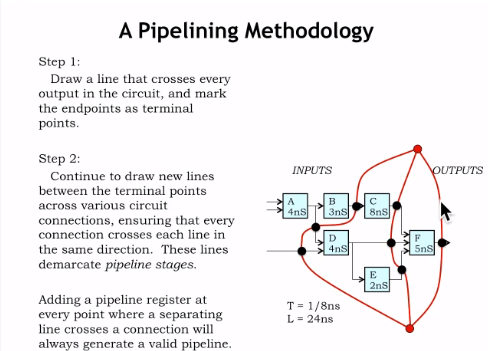

# L07_Performance_Measures
---
## 方法优化

### 概念

#### 流水线电路（pipeline circuits）

**Pipeline circuits（流水线电路）**是一种电子电路设计方法，旨在提高处理速度。这种设计方法通过将处理任务分解成多个较小的、可以并行处理的步骤来实现。每个步骤在电路的一个特定阶段（或“流水线阶段”）中完成，而且每个阶段的输出直接成为下一个阶段的输入。这样，每个阶段可以同时处理不同数据的不同部分，从而大幅提高整体的处理速度和效率。

流水线电路在许多类型的数字电路设计中都有应用，尤其是在高性能计算和数字信号处理中。比如，在微处理器设计中，流水线技术是提高处理器性能的关键技术之一。通过流水线，处理器可以在任何给定时间内执行多条指令，而不是顺序执行每条指令。

流水线电路的主要优点是提高了处理速度和吞吐量。然而，它们也带来了一些挑战，包括流水线冒险（如数据冒险、控制冒险和结构冒险）和流水线的平衡设计。流水线冒险可能会导致处理延迟，需要通过各种技术来缓解，例如前向传递、数据旁路、分支预测和指令重排序等。

流水线电路的设计和优化是计算机工程和电子工程中的一个重要研究领域，旨在不断提高电子设备的性能和效率。

#### 数据潜伏期(latency)

数据**潜伏期**，就是输入一个数据到返回一个结果的时间
如图
X输入的数据经过$F(X),G(X),P(X)$处理后返回得到结果，那么，这段处理数据的总时长，就被称为**潜伏期（latency）**

---
### 优化

#### 使用流水线电路优化

##### 不使用流水线电路
不使用流水线电路时，我们通常是**接收到上一组数据输出之后再输入下一组数据**。
这样，如上图数据潜伏期等于最长时间路径，就是$25+20=45(ns)$，输出频率为$\frac{1}{45}ns^{-1}$
这样会导致输出的缓慢，效率不高。

##### 使用流水线电路

使用流水线电路时，我们不必等上一组输出是否已经到达，我们只需要像流水线一样输入数据。
首先我们需要确定一个时钟，取需要最长时间的元器件的时间($CLK = 25ns$)。
这样数据的潜伏期就是时钟x处理步骤($n*CLK = 50ns$),输出频率为时钟的倒数($\frac{1}{25}ns^{-1}$)
效率显著提高

---

### 理清电路

#### 寄存器数量
如图，我们从最终的输出出发，依次将同等级的输出划到一起，红线与电路交叉的地方就需要一个寄存器。

#### 计算潜伏期（latency）与输出频率
如图，通过绘制 红线 我们将电路分成了三部分，那么完成每一个部分的时间为一个时钟，由于传播延迟（popagation delay）最长的组件为C（8ns）所以，**时钟**为8ns，潜伏期为3*8=24（ns）

## 多元器件串行转并行
### 概念简介
有时我们可以看到C这个电子元件占用了8ns的传播延迟,比其他电子元件长了很多,这时,针对元器件C,我们可以进行一些优化

### 元器件介绍

我们可以利用两个**元器件C**连成上图所示的电路结构。
当时钟**上升沿**时,输出处的多路选择器(MUX)更改选择的元器件,同时,左下方的DFF的D脚发生改变,$X_i$的(输入)选择的元器件($C_0,C_1$)切换,这样就把8ns的延迟通过并行模式减少到了4ns。

**图表(Graph)**

所以这个电路的**延迟(Latency) = 2 $clk$**;**输出频率 = 1 ${clk}^{-1}$**

### 组合电路

按照一开始的方法划线,我们一共需要7个DFF(交点处)所有元器件中最长的延迟为5ns,所以电路的**延迟(Latency) = $25ns$**,**频率(F) = $\frac{1}{5}{ns}^{-1}$**

## 选择合适的控制结构
### 同步&异步
同步电路和异步电路是数字电路的两种基本类型，它们在时序控制方面有根本的不同。

同步电路：
- **区别**：同步电路的所有操作都是由一个统一的时钟信号控制的。这意味着电路中的所有状态变化（比如寄存器之间的数据传输）都是在时钟信号的一个特定边缘（通常是上升边缘或下降边缘）上发生的。
- **优点**：
  - **预测性**：由于所有操作都与全局时钟同步，设计者可以预测数据在电路中的确切流动时间。
  - **简化设计**：时钟信号简化了时序设计，因为设计者只需要考虑与时钟边缘同步的事件。
  - **易于调试和验证**：同步电路通常更容易测试和验证，因为时序是确定的。
- **缺点**：
  - **时钟偏斜**：在非常高的频率下，确保时钟信号在整个芯片上保持同步是非常困难的。
  - **功耗**：即使某些部分不需要时刻工作，全局时钟信号也会导致整个电路消耗功率。
  - **性能限制**：整个电路的性能受限于最慢的路径，因为所有操作都需要在一个时钟周期内完成。

异步电路：
- **区别**：异步电路不依赖于全局时钟信号来同步操作。每个部分的操作仅在需要时启动，通常是响应其他操作的完成。
- **优点**：
  - **降低功耗**：只有当数据需要处理时才激活电路的各个部分，因此可以减少功耗。
  - **避免时钟偏斜问题**：由于不存在全局时钟，时钟偏斜问题不再是问题。
  - **潜在的更快性能**：在某些情况下，异步电路可以比同步电路快，因为它们可以在数据准备好时立即处理，而不是等待下一个时钟周期。
- **缺点**：
  - **设计复杂**：异步电路的设计通常更加复杂，因为需要考虑的独立时间事件更多。
  - **难以调试和验证**：由于没有统一的时钟信号，异步电路的测试和验证可能会更加困难。
  - **数据竞争和冒险**：如果设计不当，异步电路可能会遇到数据竞争和逻辑冒险，这可能导致不确定的行为。

因此，选择同步电路还是异步电路需要根据应用的具体需求、设计的复杂性以及可接受的功耗水平等因素综合考虑。
### 综合考虑

这张图片是一个关于控制结构分类的说明性图表，它分为同步（Synchronous）和异步（Asynchronous）两个大类，每个大类又分为全局定时（Globally Timed）和局部定时（Locally Timed）两个小类。图表的每个部分都对应一些设计理念的说明。

在同步部分：
- **全局定时**：这意味着有一个集中的时钟驱动的有限状态机（FSM）生成所有控制信号。这种设计容易实现，但是固定大小的时间间隔可能会浪费，因为它不考虑数据依赖的时间问题。
- **局部定时**：这表示每个主要子系统会同步于全局时钟生成开始和结束信号。这被认为是构建具有独立定时组件的大型系统的最佳方式。

在异步部分：
- **全局定时**：中央控制单元会根据当前任务调整当前时间片。但是，对于大型系统来说，这会导致非常复杂的时间生成器，建议对此说“不”。
- **局部定时**：每个子系统采用异步的开始，生成异步的结束信号（可能使用局部时钟）。这被认为是过去几十年中“下一个大想法”，尽管需要大量的设计工作，但在特殊情况下额外的工作是值得的。

总的来说，这张图表展示了在设计控制结构时考虑同步与异步处理，以及全局与局部定时的不同方法和它们各自的优缺点。