# L08_Design_Tradeoffs(设计权衡)

## 设计原则
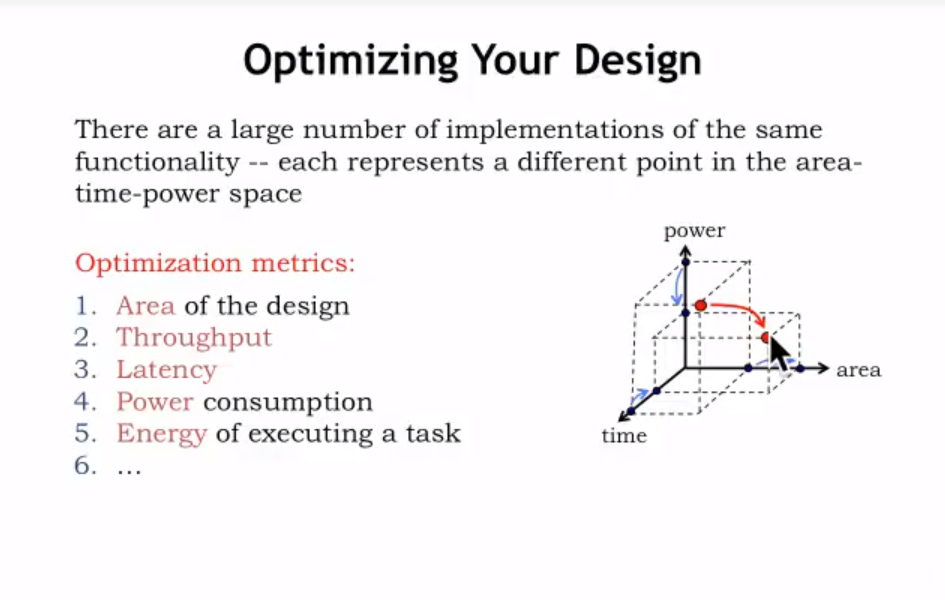

设计时,我们需要考虑很多因素
- 电路大小
- 单次输出时间(Throughput)
- 延迟(Latency)
- 能量消耗
- 执行任务的能力

### 能量耗散
#### CMOS晶体管
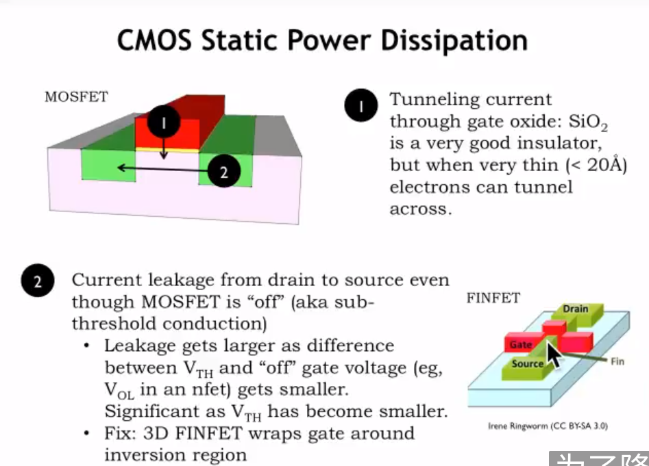

**优点**：
CMOS最大的优点在于它使用电压进行控制，不同于三极管采用电流控制，采用电压控制可以减小，甚至不浪费电能

**不足**：
随着现代电子信息技术的发展，CMOS变得越来越小，随之而来暴露了一些问题
- **门极电流泄露**：CMOS越来越小，于是门极上的金属氧化物层变得越来越薄（也许只有十几个原子厚），电流可以通过金属氧化物的缝隙进入CMOS造成能量损失。
- **关闭状态源极与漏极存在电流**：CMOS尺寸的变小，导致源极（Source）与漏极（Drain）的距离不断缩小，这样导致了**阈值电压**的降低，可能原先5V导通，现在可能4.5V就行；同时在**门极关闭**的情况下，漏极与源极出现了微小电流。

现代计算机有上百万、上千万的门电路组成，每个门都漏电流，将会造成很大的电能耗散。

**解决方法**
- **更新CMOS的设计**：使用3D FINFET，使门极中的金属氧化物层"包住"半导体层,而不是简单地单面贴合

#### CMOS基本电路(INV)

**基本概念**:
- f ~ 1GHz  :电容一秒钟约进行$10^9$次充放电
- N ~ $10^8$:一个周期有大约1亿个节点充放电
- C ~ 1fF   :电容大小是1fF
- V ~ 1V    :V大约是1Volt

**损耗原因**
电容器按上式所列进行充放电,将会造成极大的电能损耗,最终造成100W的功耗

**计算公式**
C(电容器)放电损耗：

$P_{NEFT}=f_{clk} \int^{t_{clk}/2}_{0}i_{NEFT} V_{OUT} dt$

$P_{NEFT}=f_{clk} C \int^{t_{clk}/2}_{0} -C \frac{dV_{OUT}}{dt} V_{OUT} dt$

$P_{NEFT}=f_{clk} C \frac{V_{DD}^2}{2}$

C(电容器)充电损耗：

$P_{PEFT}=f_{clk} \int^{t_{clk}}_{t_{clk}/2}i_{PEFT} V_{OUT} dt$

$P_{PEFT}=f_{clk} C \int^{t_{clk}}_{t_{clk}/2} C \frac{dV_{OUT}}{dt} V_{OUT} dt$

$P_{PEFT}=f_{clk} C \frac{V_{DD}^2}{2}$

将条件代入计算得 P = 100W

---

## 减少损耗
由上可知,CMOS电路的损耗大多源自于门电路的电压转变,那么,减少CMOS电位转换的次数和频率,就能降低功耗
### 使用ALU(关闭不用的功能)
**这是一个基本的ALU**
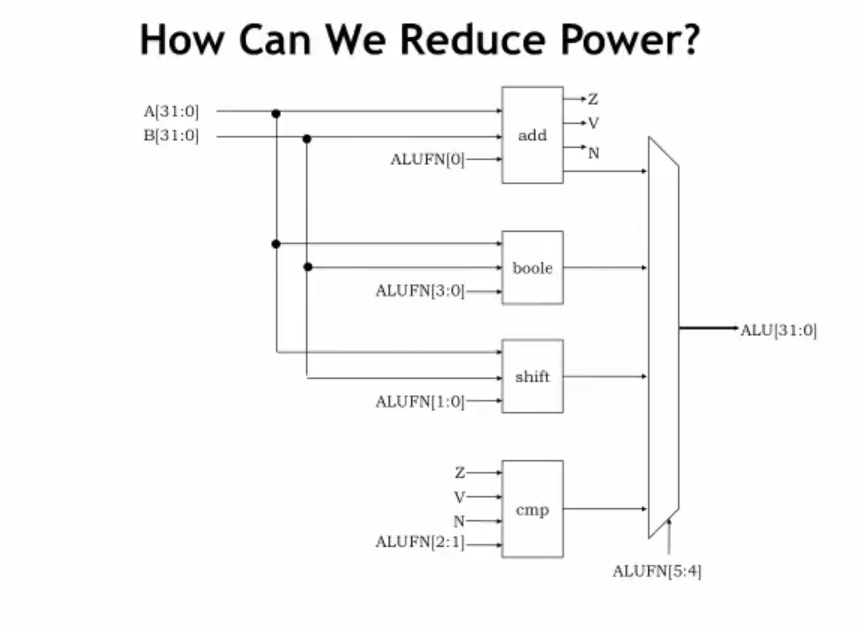

**如何使用ALU能减小功率?**
首先添加**D锁存器**
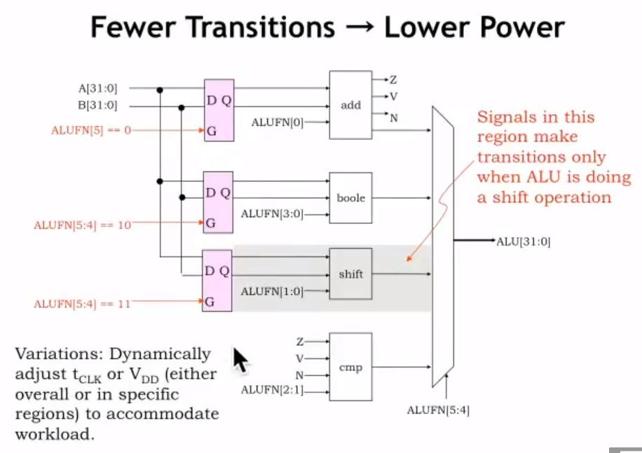
- **Q** :为什么要添加D锁存器?
**A** :D锁存器在这里扮演着数据存储和流控制的角色。失去它们可能会有以下后果：

    1. **同步问题**：D锁存器提供对信号的同步化，确保数据在特定时钟周期内有效。去掉它们可能会导致数据在不正确的时间被捕获，从而产生错误的结果。

    2. **信号不稳定**：在D锁存器后面的逻辑电路可能会遇到因为信号不稳定而产生的毛刺或错误的数据。这是因为D锁存器提供了一个稳定的数据输出，在其去除后，数据线上的信号可能会因为电路其他部分的变化而受到干扰。

    3. **功耗增加**：如图所示，减少信号转换次数有助于降低功耗。D锁存器的使用可能是为了确保只有在ALU执行特定操作时，例如移位操作，信号才会传递。去掉这些锁存器可能会使得信号在不需要的时候也进行转换，从而增加功耗。

    4. **电路功能受损**：D锁存器可能是电路设计中的关键组件，负责在特定的ALU功能码下激活相应的逻辑。没有了锁存器，某些操作可能无法正确执行，因为它们依赖于锁存器输出的信号来控制后续的逻辑门。

    5. **时序控制丧失**：D锁存器可以根据使能信号来控制数据的流动。去掉锁存器意味着失去了这种控制能力，从而使得电路无法精确控制数据何时被处理。

**原理**
  - **选择必要的支路**:ALU使用了多路复用器(MUX),可以选择某个单一的功能,而不是将所有支路电路全部接入,大大减小了电能损耗
  - **关闭不需要的功能**:加入D锁存器,就能通过改变门极的方法选择某一支路,而不是将所有的支路都选中; 除此之外,使用D锁存器还能保证只要D锁存器被激活，就不用再对其进行操作，减少了电位改变造成的额外功耗
  - **改变时钟频率和电压大小**：在使用ALU的不同功能时，所需要的时钟和电压各不相同，在使用某一特定的功能时，由于ALU取消了其他功能，就能选用对应的时钟和电压，减少了能耗。这种方法叫**动态电压和频率调整**(DVFS)

## 加法运算
### 进位选择加法器 (CSA)
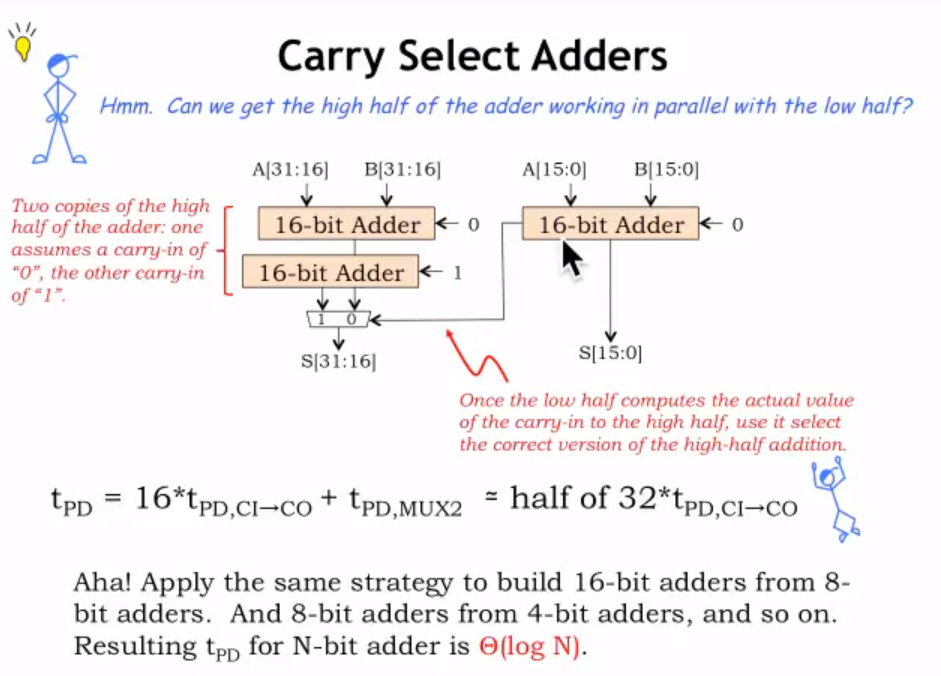

如图所示32位寄存器是由三个16位寄存器组成
- 计算**低16位**
  图的右边使用一个16位寄存器计算**低16位**如果溢出,就传**高电平**给多路复用器(MUX);如果不溢出,就传**低电平**给MUX
- 计算**高16位**
  图的左边是两个16位寄存器,分别计算**低16位进位/低16位不进位**的情况,并根据MUX的选择合适的结果
- **递归运算**
  同样,64位寄存器可以用3个32位进行组合,16位寄存器可以由3个8位寄存器组合...
  
这样组合的好处在于降低时间复杂度
**在一般情况**下如果寄存器呈线性排列,那么32位寄存器一定会比16位寄存器长至少一倍,传播延迟($t_{pd}$)至少也成x**两倍**
于是此时的时间复杂度为:
  $O(N) = N$
**基于此次优化**，高16位与第16位是同时进行运算的，极大的降低了延迟，增加了传输效率。
此时的时间复杂度为：
  $O(N) = log_2N$
**优点**:简单,复杂性低
**缺点**:需要等待低位的结果,延迟长

### 超前进位加法器 (CLA)
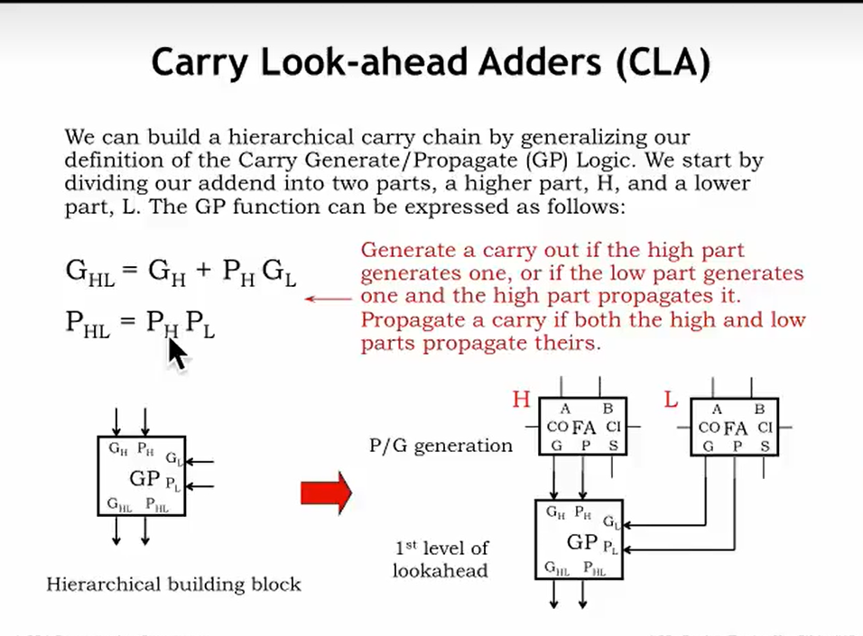
与CSA不同，**CLA通过一组逻辑函数来快速计算每一位的进位**，而不是在物理上并行计算两种情况。CLA使用了两个关键的逻辑函数：生成函数（G）和传递函数（P）。生成函数确定当给定两个加数位时是否会产生一个进位，而传递函数确定是否可以将一个低位的进位传递到高位。这两个函数允许**CLA在不等待低位结果的情况下预测高位的进位**。具体来说：

1. 生成函数 \( G_i \)：如果某一位的两个加数都是1，则该位会“生成”一个进位，即 \( G_i = A_i \cdot B_i \)。
2. 传递函数 \( P_i \)：如果至少有一个加数是1，则该位会“传递”一个进位，即 \( P_i = A_i + B_i \)。
3. 实际进位[^C] \( C_{i+1} \)：对于第 \( i \) 位的实际进位输出 \( C_{i+1} \) 是由本位的生成函数，或者是本位的传递函数和上一位的进位输入 \( C_i \) 的或操作来决定的，即 \( C_{i+1} = G_i + P_i \cdot C_i \)。

通过这种方式，CLA能够几乎同时地计算所有位的进位，而无需等待每一位逐渐传递其进位。这种方法大大加快了加法过程，特别是对于大型数字。

[^C]:$C_i$指的是第i位的进位

**时间复杂度**:$O(N) = log_2N$
**优点**:计算速度快,不用在乎低位的运算结果
**缺点**:电路复杂

**这是产生电路(GP moudle)**
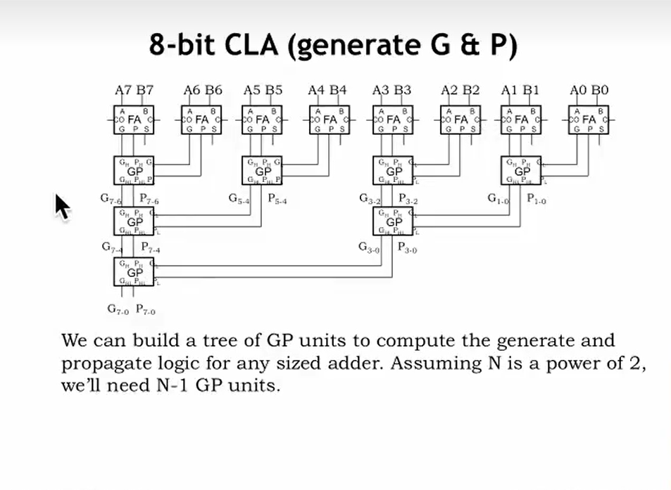

**这是传播电路(C moudle)**
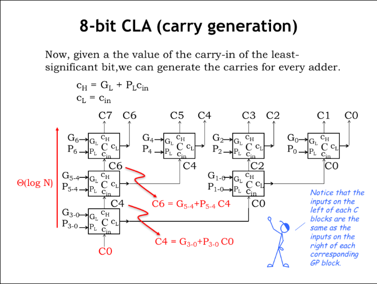

**两者组合形成加法器**
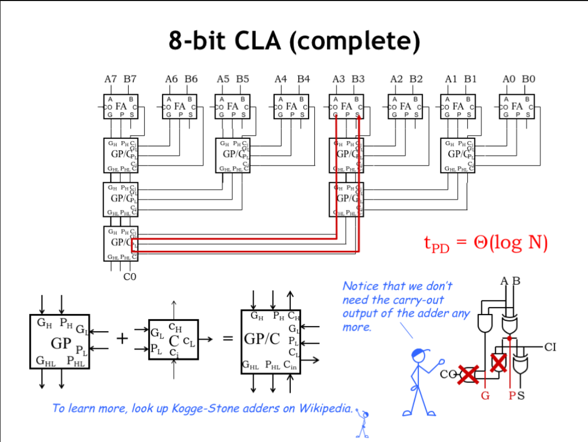

GP moudle + C moudle = single carry-lookahead module
同时我们不再需要$C_{out}$这个数据,原因如下:
- **需要立即得到结果而非时序性地**:CLA的设计初衷就是为了减少运算时间,向下一个元器件发送$C_{out}$需要时间,增加了传播延迟
- **$C_{oi}$可由递归方程得到**:已知$C_0=0;C_{i+1} = G_i + C_{i}*P_i$不需要再进行重复运算

综上,我们获得了一个传播延迟为:$O(N) = logN$的加法器,做到了最大优化

**利用此电路计算0x8F+0xAF**
| 位  | A7 | A6 | A5 | A4 | A3 | A2 | A1 | A0 |
|-----|----|----|----|----|----|----|----|----|
| A   |  1 |  0 |  1 |  0 |  1 |  1 |  1 |  1 |
| B   |  1 |  0 |  0 |  0 |  1 |  1 |  1 |  1 |
| G   |  1 |  0 |  0 |  0 |  1 |  1 |  1 |  1 |
| P   |  1 |  0 |  1 |  0 |  1 |  1 |  1 |  1 |
| C   |    |  1 |  0 |  0 |  0 |  1 |  1 |  1 |  0 |
| S   |  0 |  1 |  1 |  0 |  1 |  1 |  1 |  0 |

得到的进位结果C为" 1000111"

综上得到的公式为
$$
\begin{align}
G_i =&\space A_i * B_i  \\
P_i =&\space A_i + B_i  \\
P_i =&\space A_i xor B_i(actually)\\
C_{i+1} =&\space G_i + (P_i*C_i)  \space [C_{-1} = 0]\\
S_i =&\space A_i\space xor \space B_i \space xor \space C_i
\end{align}
$$
**具体情况**:
- $A_i$ = 1 ; $B_i$ = 1 $C_i$ = 1则$P_i$ = $A_i$ + $B_i$ = 1 , $G_i$ = $A_iB_i = 1$ , 因此0x1+0x1+0x1(C_i 进位) = 0x11.根据$S = A_i\space xor \space B_i \space xor \space C_i$ S = 0x1.$C_{i+1} = G_i + (P_i*C_i) = 0x1$

## 乘法运算
### 基础乘法器(Multipler)
**二进制乘法**
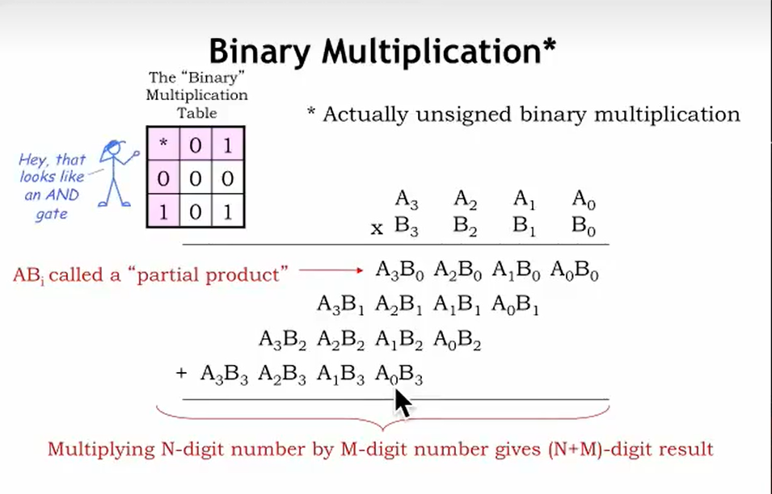

就像小学乘法一样,1个N位的乘法算式,由N个部分相加得到结果,在每个部分中有需要进行一位一位的乘法运算,而在二进制的惩罚中,乘法表格和AND门的真值相同,实验,我们可以用AND门搭建乘法器

**乘法器内部电路**
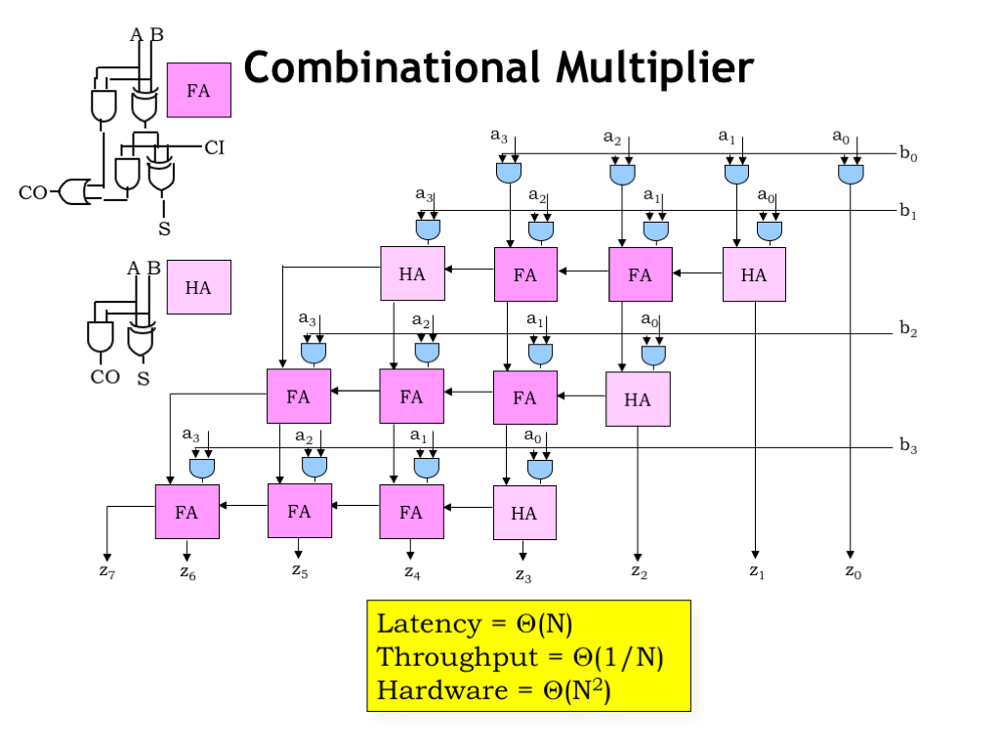

- **HA**:半加器(Half Adder)计算两输入的加法
- **FA**:全加器(Full Adder)计算三输入的加法

在进行乘法运算时,数据向左和向下依次时序传递,并且,该电路具有M行N列
因为M和N只相差1,所以近似认为潜伏期(Latency)为$O(N)$
使用的电子元件总数量为$O(N^2)$

### 改进乘法器
#### 有符号整型乘法

在进行有符号整型的处理时,我们要确定值的符号位,并添加补码.
红色字体处为补码位
如图,一个四位整型数据(1位符号位,3位数据位)进行乘法运算时,需要进行一些数学运算

**列成电路图表示为**
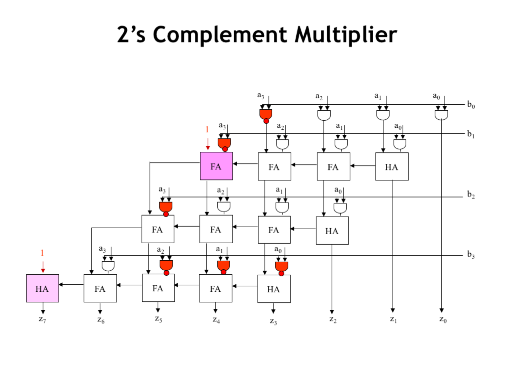

#### 提高输出效率
##### 流水线化
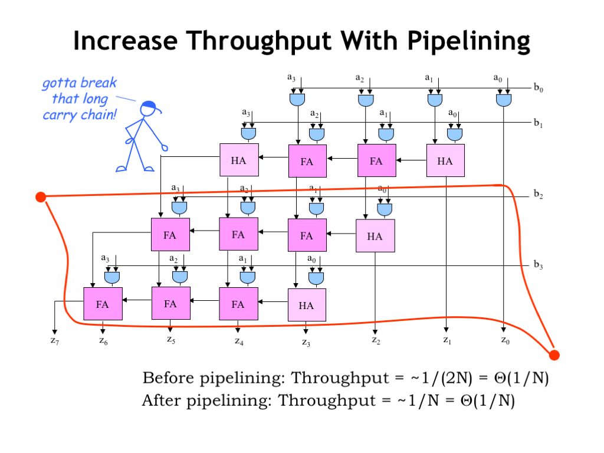

在刚刚得到的图表中:
- **流水线化之前**:Throughput(吞吐量) = 1/2N = O(1/N)
- **流水线化之后**:Throughput(吞吐量) = 1/N  = O(1/N)

如果我们引入管道(在电路图外点上两点,连接所有同步输出点,装上寄存器)也不能提高吞吐量,原因在于**加法器不仅是自上而下传递数据,而且需要自右向左传递数据**
所以还需要继续优化

##### 传递优化
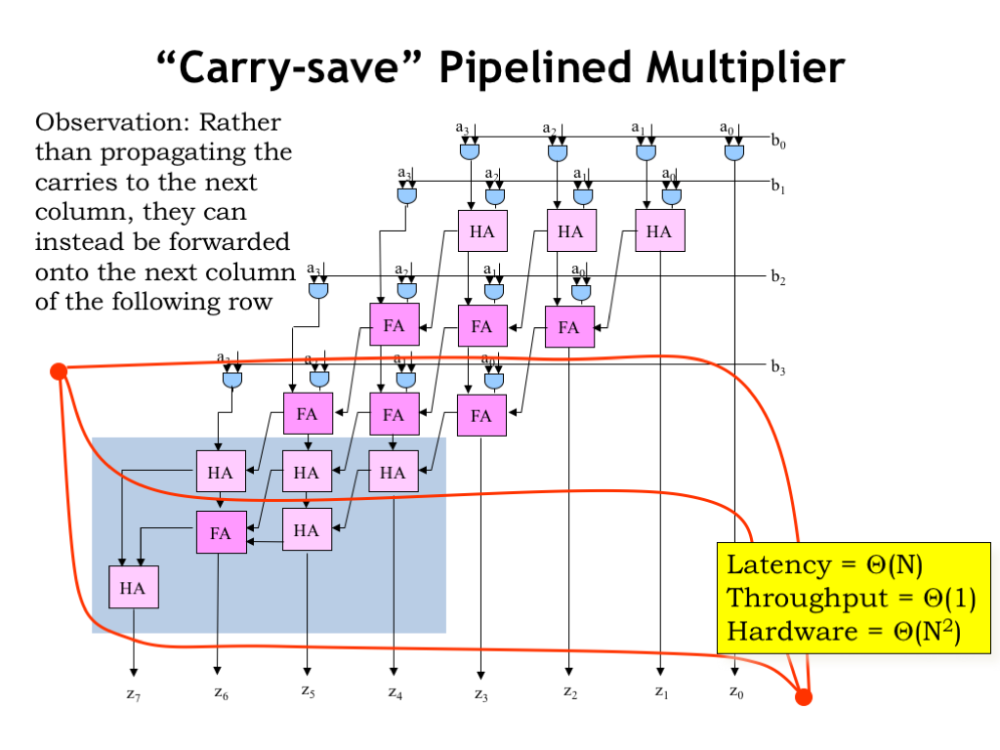

现在我们禁止数据自左向右传递,只允许向下传递(懒得解释,自己理解吧)
少了自左向右传递的过程,那将会大大提高吞吐量,于是:
$$
\begin{align}
Throughput = & O(1)\\
Latency = & O(N) \\
Hardware = & O(N^2)
\end{align}
$$