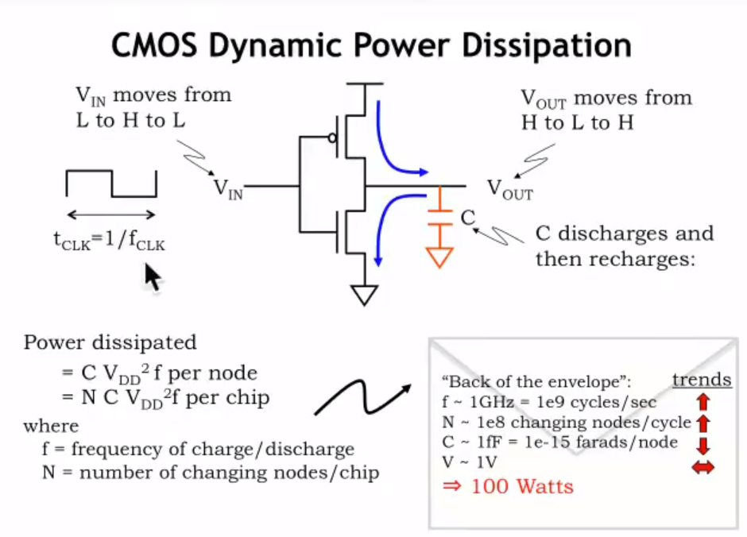

# L08_Design_Tradeoffs(设计权衡)

## 设计原则

设计时,我们需要考虑很多因素
- 电路大小
- 单次输出时间(Throughput)
- 延迟(Latency)
- 能量消耗
- 执行任务的能力

### 能量耗散
#### CMOS晶体管

**优点**：
CMOS最大的优点在于它使用电压进行控制，不同于三极管采用电流控制，采用电压控制可以减小，甚至不浪费电能

**不足**：
随着现代电子信息技术的发展，CMOS变得越来越小，随之而来暴露了一些问题
- **门极电流泄露**：CMOS越来越小，于是门极上的金属氧化物层变得越来越薄（也许只有十几个原子厚），电流可以通过金属氧化物的缝隙进入CMOS造成能量损失。
- **关闭状态源极与漏极存在电流**：CMOS尺寸的变小，导致源极（Source）与漏极（Drain）的距离不断缩小，这样导致了**阈值电压**的降低，可能原先5V导通，现在可能4.5V就行；同时在**门极关闭**的情况下，漏极与源极出现了微小电流。

现代计算机有上百万、上千万的门电路组成，每个门都漏电流，将会造成很大的电能耗散。

**解决方法**
- **更新CMOS的设计**：使用3D FINFET，使门极中的金属氧化物层"包住"半导体层,而不是简单地单面贴合

#### CMOS基本电路(INV)

**基本概念**:
- f ~ 1GHz  :电容一秒钟约进行$10^9$次充放电
- N ~ $10^8$:一个周期有大约1亿个节点充放电
- C ~ 1fF   :电容大小是1fF
- V ~ 1V    :V大约是1Volt

**损耗原因**
电容器按上式所列进行充放电,将会造成极大的电能损耗,最终造成100W的功耗

**计算公式**
C(电容器)放电损耗：
$P_{NEFT}=f_{clk} \int^{t_{clk}/2}_{0}i_{NEFT} V_{OUT} dt$

$P_{NEFT}=f_{clk} C \int^{t_{clk}/2}_{0} -C \frac{dV_{OUT}}{dt} V_{OUT} dt$

$P_{NEFT}=f_{clk} C \frac{V_{DD}^2}{2}$

C(电容器)充电损耗：
$P_{PEFT}=f_{clk} \int^{t_{clk}}_{t_{clk}/2}i_{PEFT} V_{OUT} dt$

$P_{PEFT}=f_{clk} C \int^{t_{clk}}_{t_{clk}/2} C \frac{dV_{OUT}}{dt} V_{OUT} dt$

$P_{PEFT}=f_{clk} C \frac{V_{DD}^2}{2}$

将条件代入计算得 P = 100W