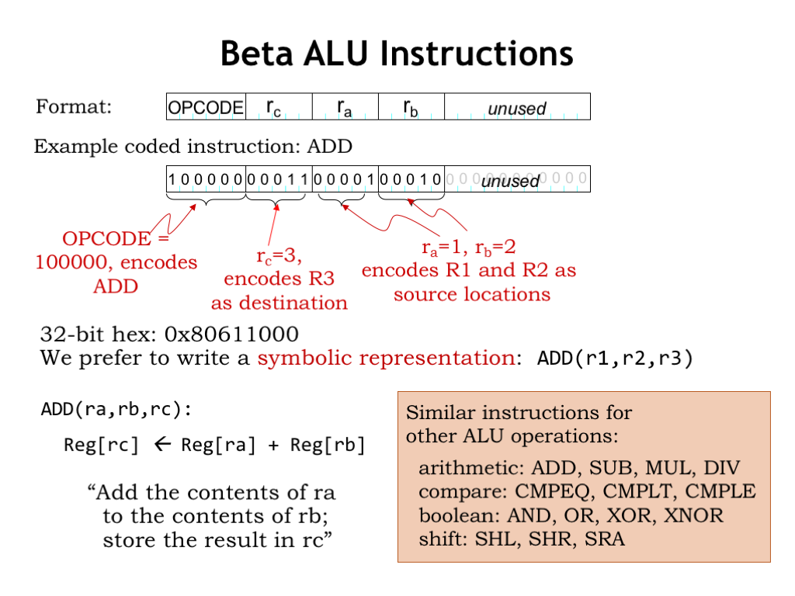
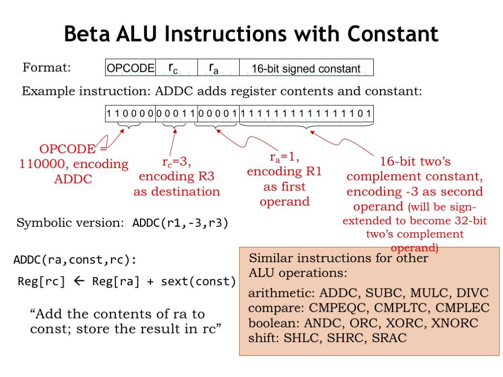

# L09_Instruction_Set_Architectures(指令集架构)

## 如何做一个指令集架构
制作一个指令集架构是一件非常难的事
- 多少个元器件
- 什么形式的存储,要多大
- 怎么加密指令
- 怎么保证不过时

## 指令集架构
### ALU指令
#### 变量加法

在图中,我们可以看到,对于一个32bit的ALU指令,前6位代表了要进行的操作,如b'100000'为加法指令;之后的5位代表了目标地址$r_c$: b'00011' ; 再之后的五位则是输入数据$r_a$的地址:b'00001';然后是输入数据$r_b$的地址b'00010',最后是没有用到的数据位.
将指令换算成十六进制数为:0x80611000
指令:ADD($r_a,r_b,r_c$)
Reg[$r_c$] = Reg[$r_a$] + Reg[$r_b$]

#### 常量加法(add const)

指令ADDC(r1,-3,r3)
r3 = r1 -3

注意，如果我们需要一个常量操作数，其表示不适合16位，那么我们必须将该常量作为32位值存储在主存中，并将其加载到寄存器中以供使用，就像我们将任何变量值加载到寄存器中一样。

所以,一共有两种形式的操作码:
- 运用两个寄存器中的值
- 运用一个寄存器中的值和一个常量

