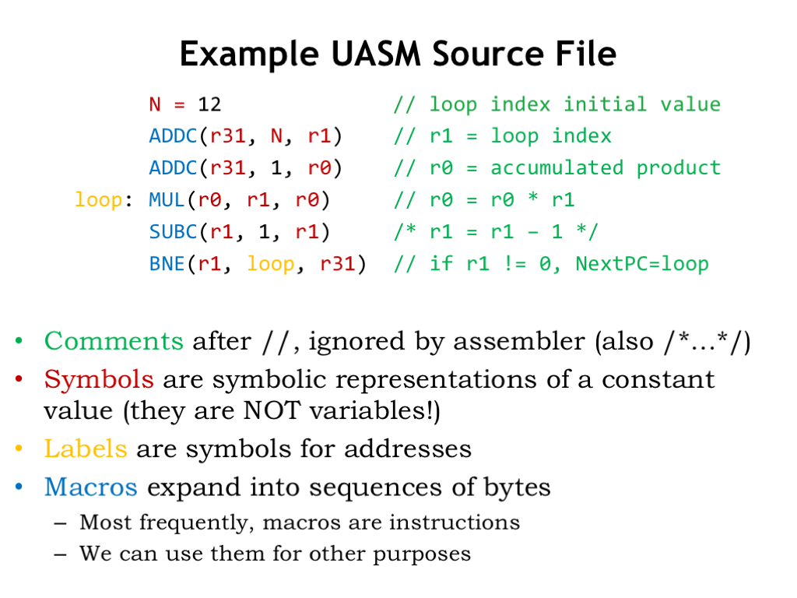
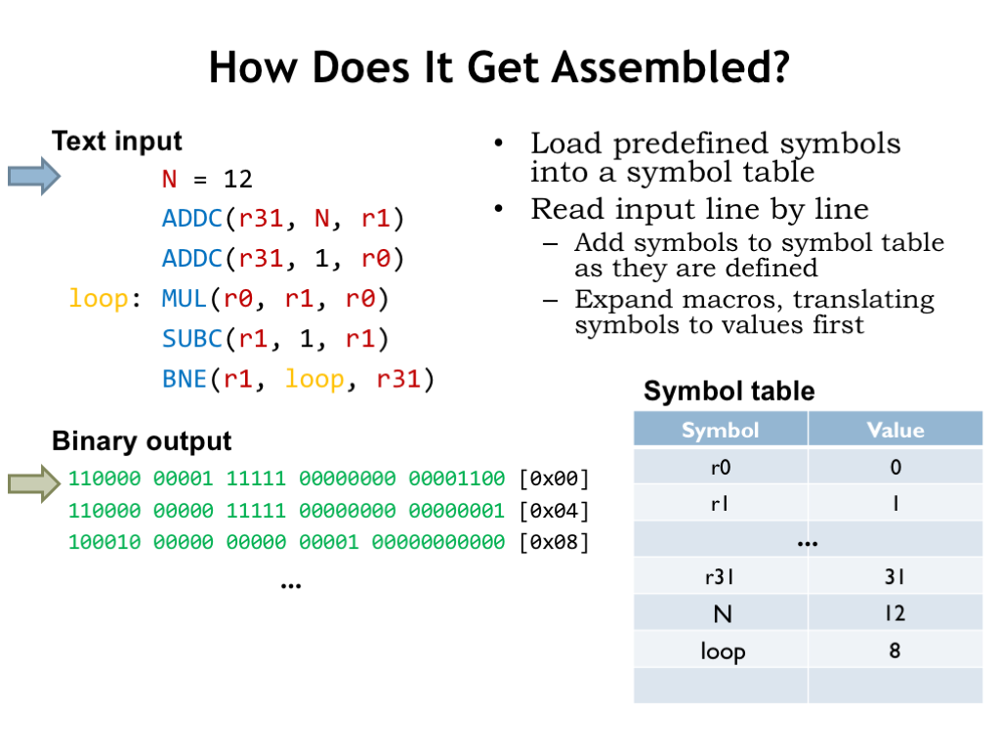
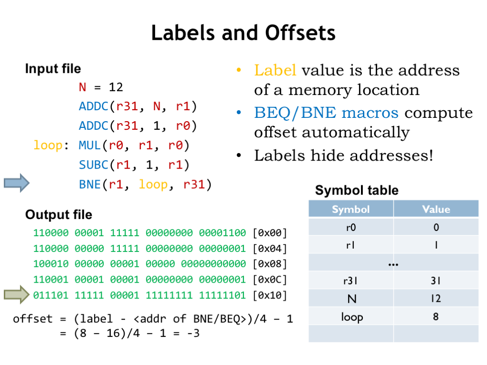

# L10a_Assembly_Language(汇编语言)
## 使用范例

这是一张简单的汇编语言,下面我将介绍一下它的几个元素:
- " // " :这是注释
- "ADDC" :这是ALU指令(或者说是宏)
- "N" :符号,用来表示常数
- "loop" :标签,用来表示地址

**下面介绍如何使用这些元素**

首先明确一个概念:
寄存器r0,r1,r2...r31 使用的是红色标签,也就是说,它门指代的都是常量r0=0;r1=1...

让我们一行一行来解读
- N = 12:
    把N添加到符号表中,并赋值12

- ADDC(r31,N,r1)
    查表得到N = 12,将r31指向的内存中的数据与常量N相加,并赋值到r1指向的地址
    $r1 = r31 + N[0x00]$
    机器码为:
    110000 00001 11111 00000000 00001100
    
- ADDC(r31,1,r0)
    将r31指向的内存中的数据与常量1相加,并赋值到r0指向的地址
    $r0 = r31 + 1[0x04]$
    机器码为:
    110000 00000 11111 00000000 00000001

- loop: MUL(r0,r1,r0)
    1. 将标签loop放到符号表中,值为其所在的地址(0x08)
    2. 执行乘法运算$r0 = r0 * r1$
    
    机器码为:
    100100 00000 00000 00001 00000000000

## 偏移与跳转

重点:Offset == -1

offset计算
$$
\begin{align}
offset =& (label - <addr of BNE/BEQ>)/4 -1\\
=&(0x08 - 0x10)/4 - 1\\
=&-3
\end{align}
$$
