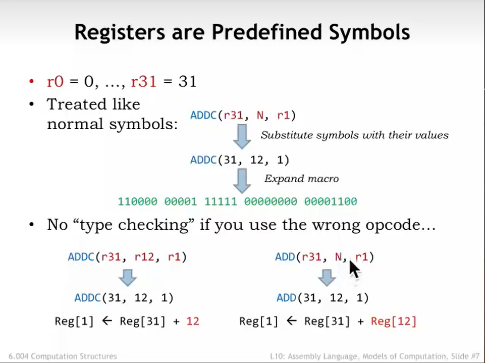
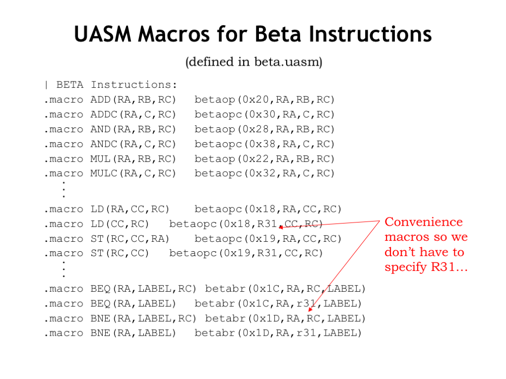
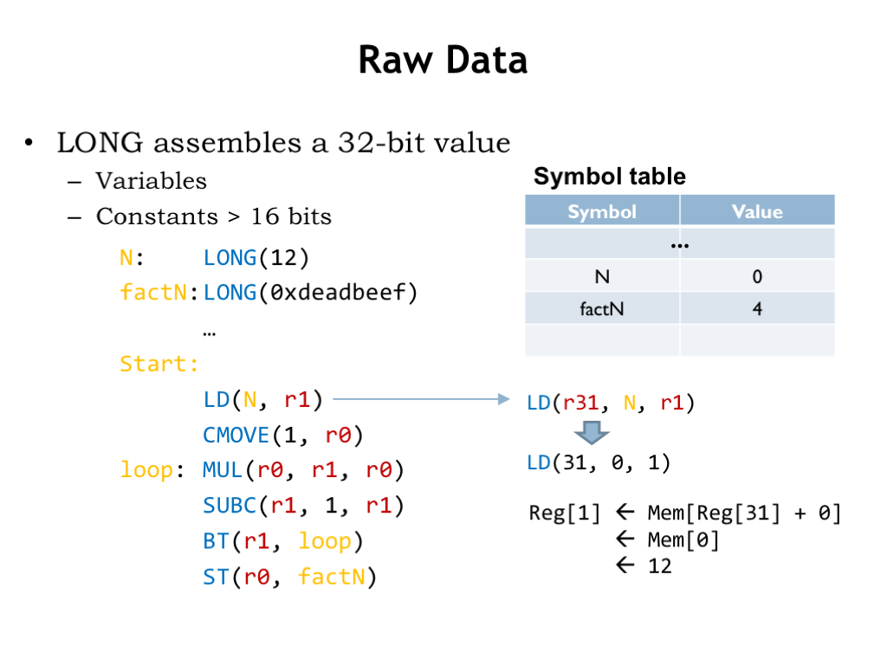
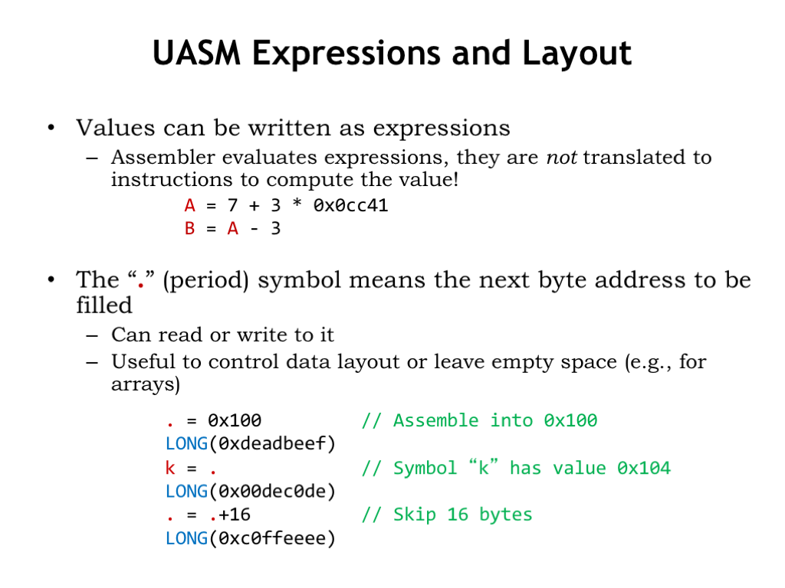
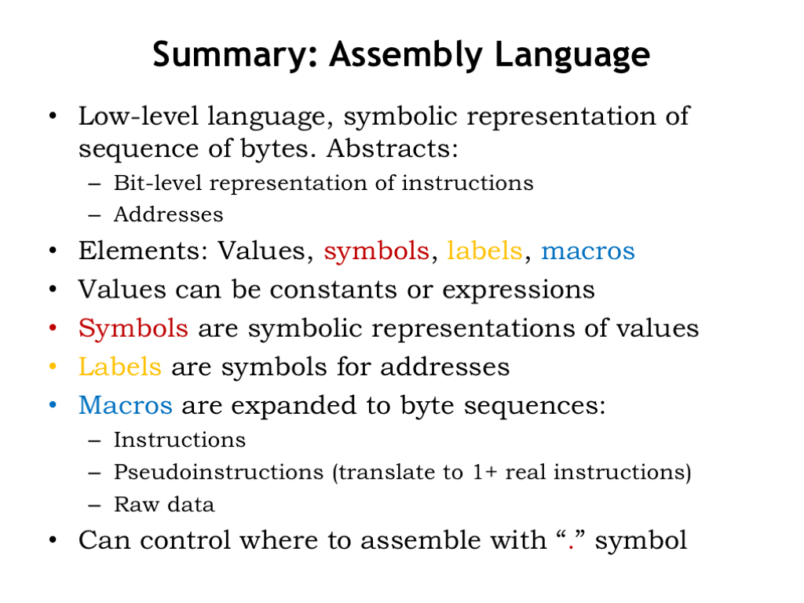

# L10a_Assembly_Language(汇编语言)
## 使用范例


这是一张简单的汇编语言,下面我将介绍一下它的几个元素:
- <font color=Chartreuse>" // "</font> :这是注释
- <font color=CornflowerBlue>"ADDC"</font> :这是ALU指令(或者说是宏)
- <font color=Crimson>"N"</font> :符号,用来表示常数
- <font color=Gold>"loop"</font> :标签,用来表示地址

**下面介绍如何使用这些元素**


首先明确一个概念:
寄存器r0,r1,r2...r31 使用的是<font color=Crimson>红色</font>标签,也就是说,它门指代的都是常量r0=0;r1=1...

让我们一行一行来解读
- <font color=Crimson>N</font> = 12:
    把N添加到符号表中,并赋值12

- <font color=CornflowerBlue>ADDC</font>(<font color=Crimson>r31</font>,<font color=Crimson>N</font>,<font color=Crimson>r1</font>)
    查表得到N = 12,将r31指向的内存中的数据与常量N相加,并赋值到r1指向的地址
    $r1 = r31 + N[0x00]$
    机器码为:
    <font color=CornflowerBlue>110000</font> <font color=Crimson>00001</font> <font color=Crimson>11111</font> 00000000 00001100
    
- <font color=CornflowerBlue>ADDC</font>(<font color=Crimson>r31</font>,1,<font color=Crimson>r0</font>)
    将r31指向的内存中的数据与常量1相加,并赋值到r0指向的地址
    $r0 = r31 + 1[0x04]$
    机器码为:
    <font color=CornflowerBlue>110000</font> <font color=Crimson>00000</font> <font color=Crimson>11111</font> 00000000 00000001

- <font color=Gold>loop</font>: <font color=CornflowerBlue>MUL</font>(<font color=Crimson>r0</font>,<font color=Crimson>r1</font>,<font color=Crimson>r0</font>)
    1. 将标签loop放到符号表中,值为其所在的地址(0x08)
    2. 执行乘法运算$r0 = r0 * r1$
    
    机器码为:
    <font color=CornflowerBlue>100100</font> <font color=Crimson>00000</font> <font color=Crimson>00000</font> <font color=Crimson>00001</font> 00000000000

p.s 在这个表中我们可以看到loop的值为8,**8是由于loop的地址为0x08**(N这行定义不算在地址里面)

## 偏移与跳转


**重点:loop语句自己的Offset == -1**

offset计算
$$
\begin{align}
offset =& (label - <addr of BNE/BEQ>)/4 -1\\
=&(0x08 - 0x10)/4 - 1\\
=&-3
\end{align}
$$

## 注意事项
### 寄存器只是预先定义的常量

汇编也具有宏定义的特征,在图中可以看到
**r0=0,r1=1,...,r31=31**
所以下面两种写法实际上是**等价的**
```asm
ADDC(r31,N,r1)
ADD(r31,N,r1)
```
```asm
ADDC(31,12,1)
ADD(31,12,1)
```
区别是两句的意义不同:
$$
\begin{align}
第一句:Reg[1]<-&Reg[31] + 12\\
第二句:Reg[1]<-&Reg[31] + Reg[12]
\end{align}
$$

### 使用宏定义减轻工作量


1. 使用macro我们就能**减少书写**一些不需要改变的寄存器,就比如说:
    ```asm
    .macro LD(CC,RC)    betaopc(0x18,R31,CC,RC)
    ```
    这句话中我们减少了0x18,R31这两个变量,也能达成我们预定的效果.

2. 使用macro还能将几个**语句组合**完成不同的功能
    ```asm
    .macro PUSH(RA)     ADDC(SP,4,SP)   ST(RA,-4,SP)
    .macro POP(RA)      LD(SP,-4,RA)    ADDC(SP,-4,RA)
    ```
    这些命令的细节将会放到下一节细细阐述

### 长整型数据的处理方法
超过一定长度的数据需要存放到内存中去

首先需要定义长整型变量如图中的`N`和`factN`(32bit),在需要调用的时候需要LD命令装载到寄存器中,使用完成之后需要用到ST命令进行存储.

### 汇编器会处理简单的语句
汇编器会完成一些简单的计算,**不需要转换成指令**


在语句 A = 7+3中,并不需要添加一段ADDC命令完成计算,汇编器会自动完成7+3的计算

### "."(Period)的用法
如上图:
```asm
. = 0x100       //  定义下一个内存位置为0x100
LONG(0xdeadbeef)    //  这就意味着在"."后面的语句将会指向0x100
k = .               //  k=0x104
LONG(0x00dec0de)
. = .+16
LONG(0xc0ffeeee)
```
period的意义是指向下一个内存地址,我们将其定义为0x100,意思是接下来我们**要对0x100这个地址进行操作**.
于是第二句LONG()命令则把数据**存储在这个位置**.
第三句时由于下一内存位置已经变成了0x104,则k = 0x104.
第五句`. = .+16`则可以在中间省出一些空间,便于存放数组这样的变量.

## 总结(Summary)

在本节课,我们主要关注了以下几个方面
1. 汇编主要有**四大元素**组成:
    1. 数值(values):    可以是**常量**和**表达式**
    2. 符号(symbols):   **具象化**的数值
    3. 标签(labels):    用来**标记地址**的表达式
    4. 宏(macros):      便于**表达**和便于**组合**命令完成特定功能

2. "."(Period)的使用方法

[for more details](https://computationstructures.org/lectures/assembly/assembly.html)