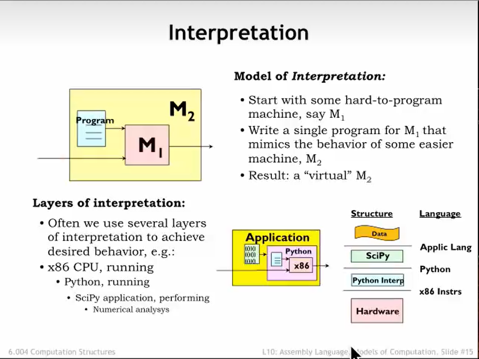
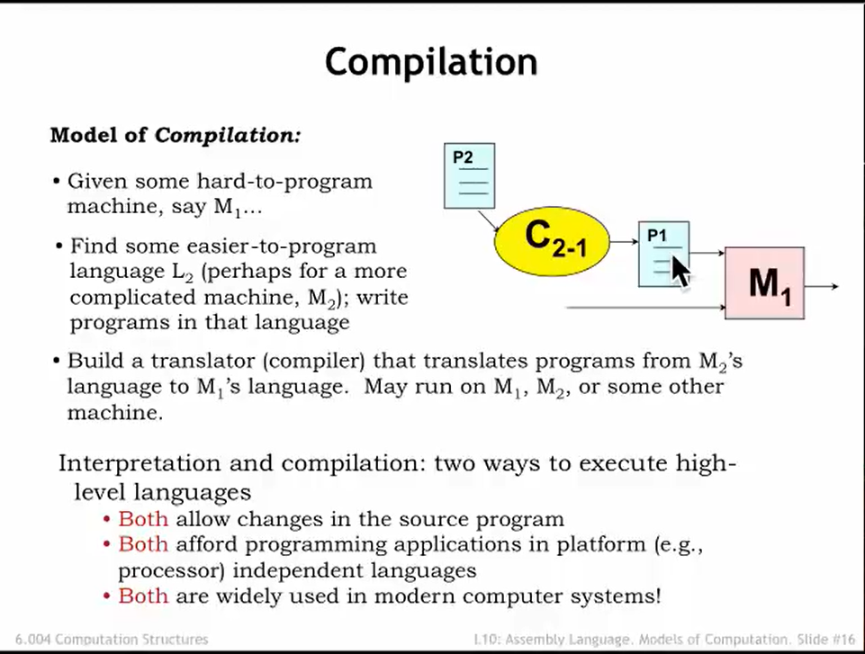
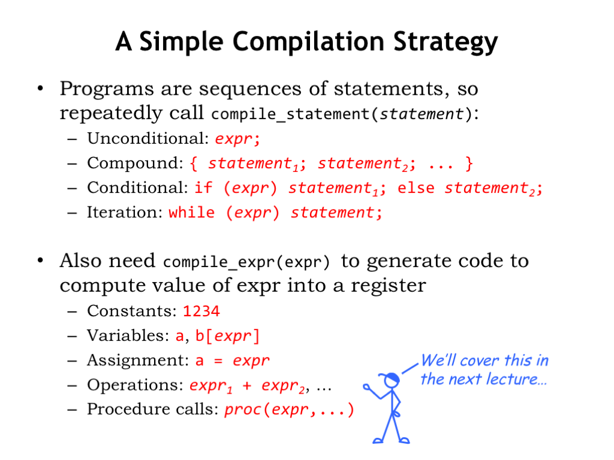
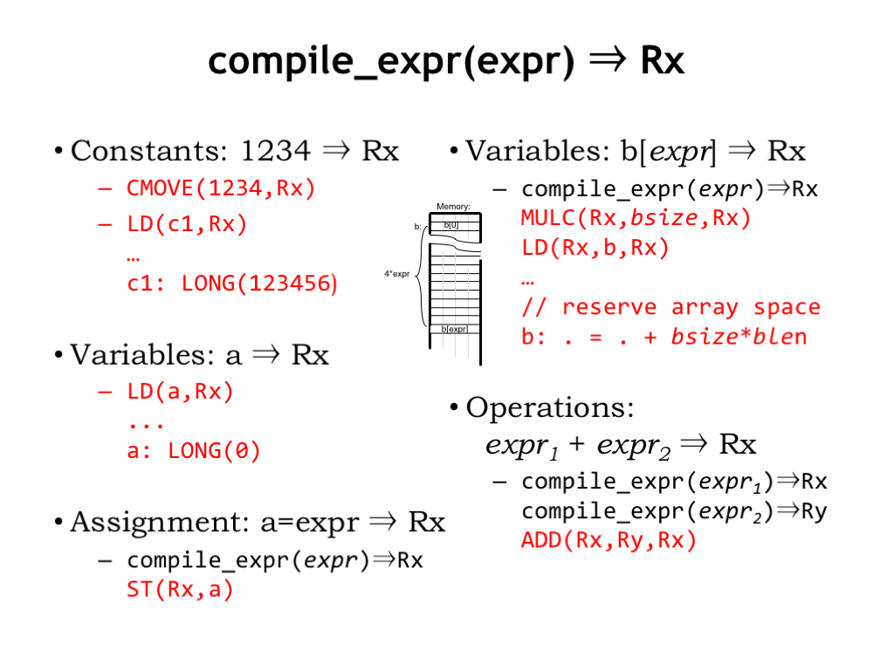

# L10b_Models_of_Computation
## 解释器和编译器

### 解释器(Interpretation)

M1是一个很难编程的机器,而M2相对简单.
解释器要做的工作就是用来在M1上**模仿**M2来让编程更加简单.
每当执行M2的指令时,实际上是在执行M1的某个序列
如图:解释器可以层层叠加
如果我需要在Intel x86上运行python程序,我可以使用python解释器,这样我就能避免使用NEX86汇编语言.
如果我想要使用SciPy来处理大量的矩阵,我就可以使用Scipy解释器,这样我就不用进行Python代码的编写.
实际上,SciPy解释器可以同时调用很多个Python指令,而Python解释器由同时调用很多的汇编指令,这样就完成了**解释器的嵌套**.

### 编译器(Compiler)
当你想要让硬件达到有最好的工作效率时,使用**编译**将会是一个很好的选择.

这里也是一样,M1是一台很难编程的机器,我们用高级语言编写P2(就比如说C语言)编译器要做的事是**将P2编写成M1能执行的P1**.
但我们想要运行程序的时候只能使用P1.

### 对比
||解释器|编译器|
|:-:|:-:|:-:|
|如何处理输入"x+2"|计算"x+2"|生成一个程序计算"x+2"|
|在什么时候处理结果|程序执行时|程序执行前|
|什么时候展示结果|程序执行时|程序编译时|
|决策什么时候进行|程序运行时|程序编译时|

## 编译策略

在编译时,主要考虑两个主要例程
1. **compile_statement**:
    compile_statement的主要作用是从源文件一行一行地进行编译,所以他需要被重复调用直到函数结束.

2. **compile_expr**:
    compile_expr的作用是计算出表达式的值并依次将其存入寄存器中

一共有四种语句需要被执行:
1. **无条件语句**:(例如:x=1+1)
    这种语句最简单,只需要执行一次就能成功编译

2. **复合语句**:(例如:x-1 && y+1)
    编译这种语句就需要按照优先级依次执行了.

3. **条件语句**:(例如:x==0?y=1:y=0)
    不必多说

4. **迭代语句**:(例如:while(i--))
    一直执行直到条件为否

## compile_expr对于不同数据类型的操作(重要!)

