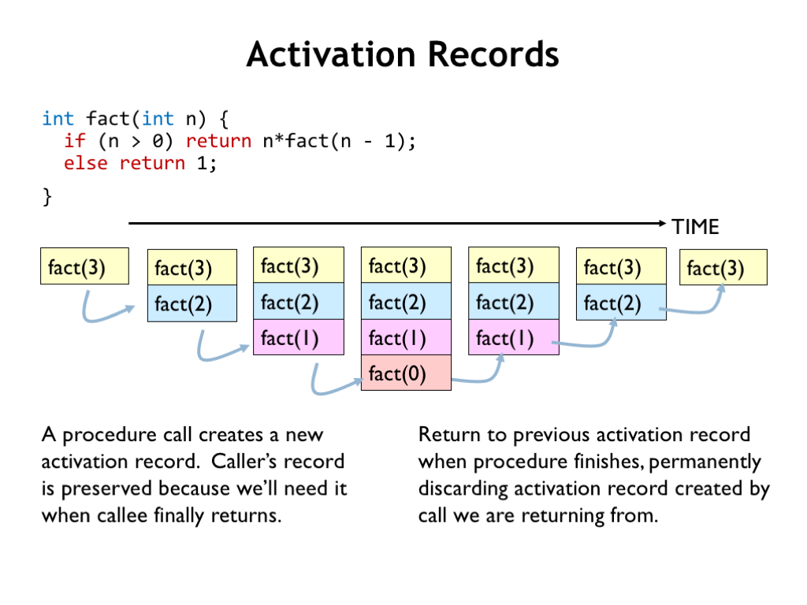
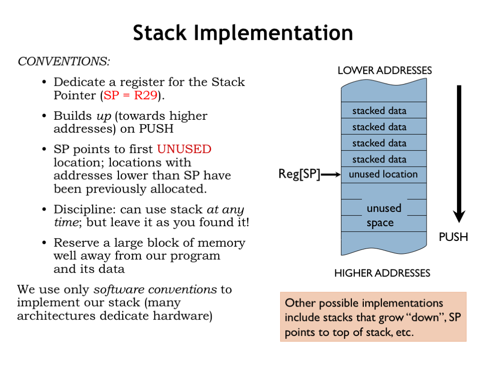
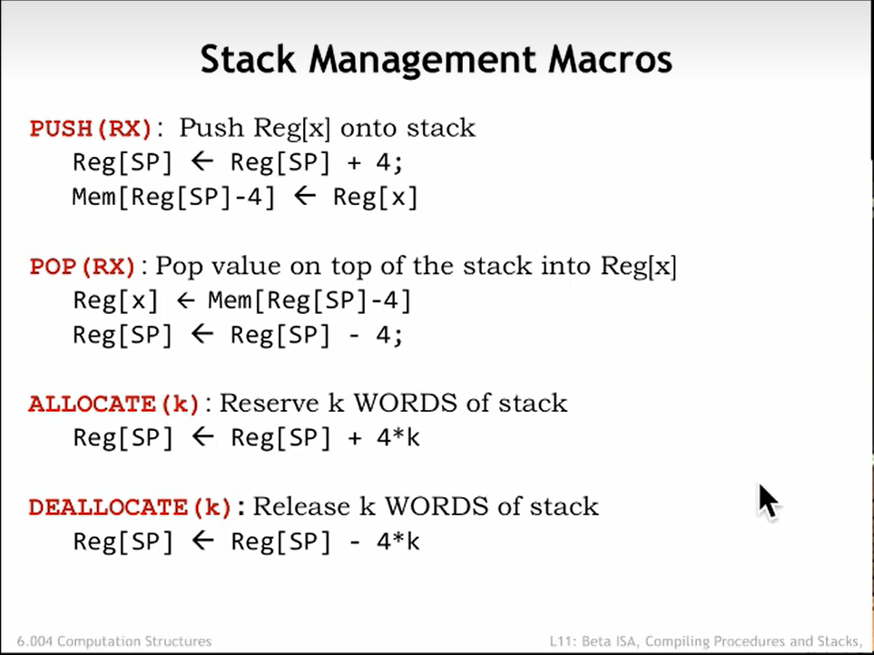
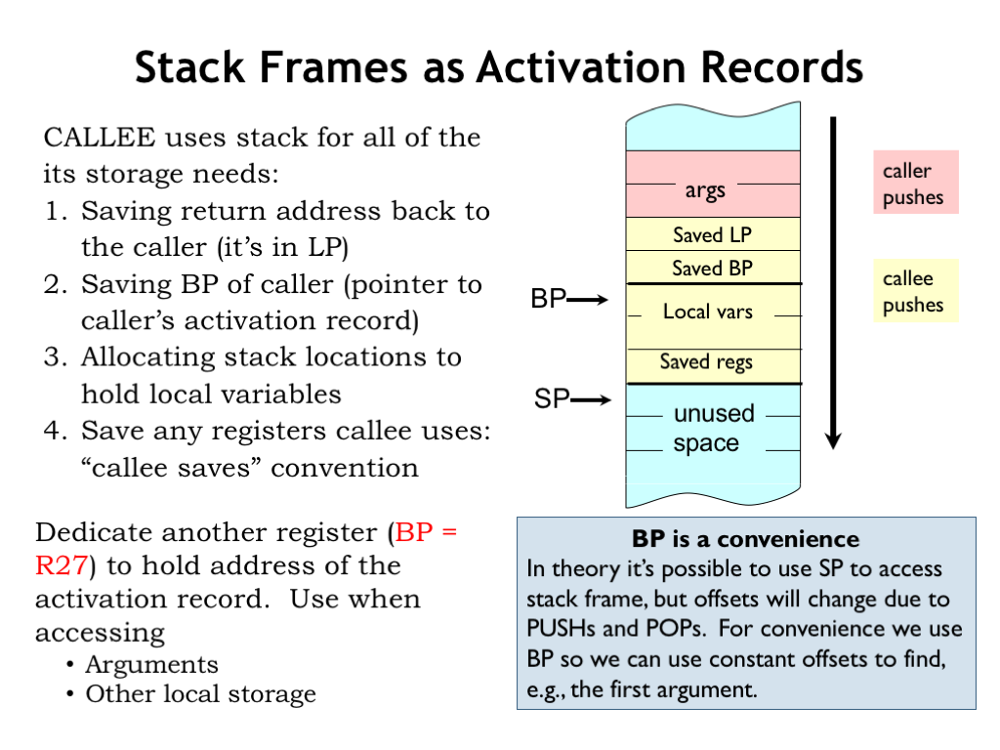
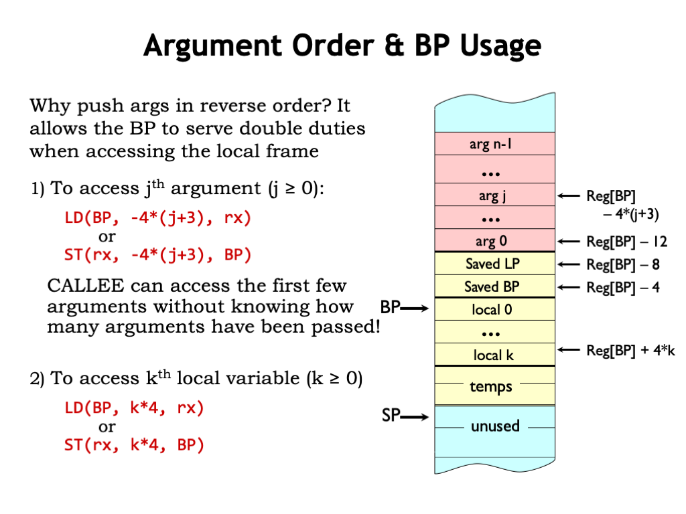
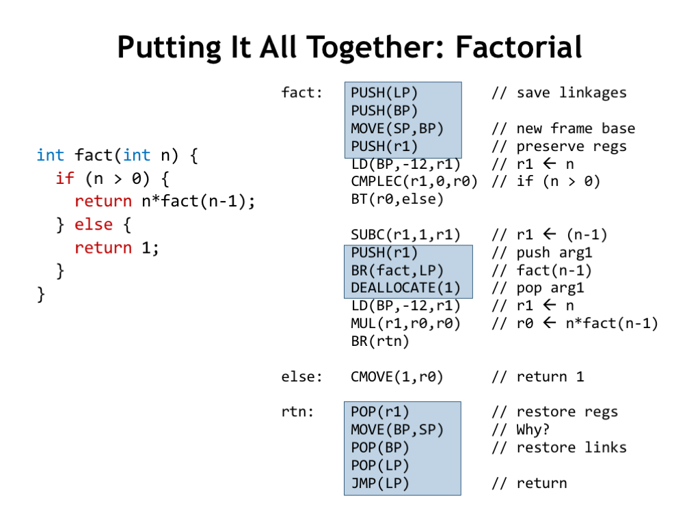

# L11_Procedures_And_Stacks

## 上节回顾


**编译过程**:
举例命令:y = (x-3)*(y+123456)
按照优先级,先计算左侧括号的表达式(x-3)中的x,将x保存到寄存器r1中
在计算(3)这个表达式,把它存到r2寄存器中
然后计算使用`SUB(r1,r2,r1)`计算(x-3),并将结果保存到r1寄存器中
同理在对公式右端进行计算,保证**以最少的寄存器完成任务**,具有很强的规律性.
`p.s`感觉这个过程有点像递归里面的压栈和出栈

## 编译表达式
上节课提到了编译的四种基本的表达式,接下来将会重点介绍四种表达式的实现方式
1. 顺序结构(无条件):
    直接调用compile_expr(expr)就能实现操作

2. 复合结构,进行一定顺序编译,把必要的结果一一放到寄存器中

3. 分支结构
    
    这是一个简单的分支结构,先计算条件,将其放入Rx寄存器中,之后使用`BF`判断条件是否成立,若不成立,跳转到`Lendif`处,成立的话编译if之中的表达式
    
    加入`else`以后也是一样的

4. 循环迭代结构
    
    这种结构和`if`的结构类似,判断条件是否成立,如果不成立就跳到`Lendwhile`处结束循环
    当然我们还能为其优化,可以先将条件初始化,然后在每次循环结束之后对条件进行更改,有点类似于`for`循环的结构

### 编译示例
```c
int n = 20;
int r = 0;
r = 1;
while(n>0){
    r = r*n;
    n = n-1;
}
```

```asm
n: LONG(20)
r: LONG(0)
start:
    CMOVE(1,r0)
    ST(r0,r)
    BR(test)
loop:
    LD(r,r3)
    LD(n,r1)
    MUL(r1,r3,r3)
    ST(r3,r)
    LD(n,r1)
    SUBC(r1,1,r1)
    ST(r1,n)
test:
    LD(n,r1)
    CMPLT(r31,r1,r2)
    BT(r2,loop)
done:
```

当然这样编译得到的结果是不完美的,因为在这个过程中进行了大量的LD,ST操作,没有完全利用寄存器资源,所以接下来我们将对其进行优化
```asm
n: LONG(20)
r: LONG(0)
start:
    CMOVE(1,r0)
    ST(r0,r)
    LD(n,r1)    //  初始化时先把n存在寄存器中,避免反复读取
    LD(r,r3)
    BR(test)
loop:
    MUL(r1,r3,r3)
    SUBC(r1,1,r1)
test:
    CMPLT(r31,r1,r2)
    BT(r2,loop)
done:
    ST(r1,n)    //  最后将结果存入内存中
    ST(r3,r)
```

## 程序和堆栈
### 调用自定义函数
```c
int gcd(int a,int b)    //  1
{
    int x=a,t=b;        //  2
    while(x != y)
    {
        if(x>y){
            x = x-y;
        }
        else{
            y = y-x;
        }
    }return x;          //  3
}
```
这是一段输出最小公约数的函数
在这位置`1`处中,`gcd`指示了程序的开始位置,接下来跟着的是哪种类型的变量(这里是两个整型变量)
在位置`2`处说明了将会分配一片内存用来存储x,y两个变量,当返回时,就需要取消分配他们的空间
在位置`3`处,我们返回了一个变量x,其中x的类型在位置`1`处已经定义过了.

```c
bool comprimes(int a,int b)
{
    return gcd(a,b) == 1;
}
```

在调用这个函数的时候没只需要知道gcd这个函数的存在,我们不需要知道它的具体内容

### 编译自定义函数
#### 内联(inlining)
编译时更多问题,使用内联(inlining)的方式进行操作不是一个好方法,尤其是遇到递归调用的函数时,会占用大量的程序空间
如这个计算阶乘的函数
```c
int fact(int n)
{
    if(n>0){
        return n*face(n);
    }else{
        return 1;
    }
}
```
当然内联在小量代码的函数时,内联将会是一种很有效的方法

#### 关联(linking)
关联则是一种很有效的方法了,关联在于重复调用某一位置的一个函数,他分为以下注意事项,这里我们将使用fact这个函数作为示例
- 将n存入R1
- 将返回的地址保存在R28
    - 使用BR(fact,R28)去调用地址,使用JMP(R28)返回原地址
- 返回的结果存放在R0中

这里是一个编程实例
```asm
fact:
    CMPLEC(r1,0,r0)
    BT(r0,else)
    MOVE(r1,r2) //  保存n的值
    
    SUBC(r2,1,r1)
    BR(fact,r28)
    MUL(R0,r2,r0)
    BR(rtn)
else:
    CMOV(1,r0) 
rtn:
    JMP(r28)

main:
    CMOVE(1,r1)
    BR(fact,r28)
    HALT()
```
当然聪明的你一定会发现这个示例其实是不正确的,注意看r28的值,在main中调用BR时,已经将地址传递给了r28.在运行到fact中的BR语句时,r28的值又被覆盖了,因此我们需要改进程序,让他能够保存跳转之前的状态

### 栈与调用


所以我们需要借用栈(Stack)这个概念
主要操作:
- push:放入栈中
- pop :从栈中取出

接下来是栈的特点
1. 定义一个栈指针(SP)
    在我们的Beta Assembly中,栈指针数据通常存放在r29中(**SP = R29**)
    栈指针从低地址处出发,当参数进入栈中时,栈指针指向下一块没有被用到的地址
    

2. 指令集(宏)
    PUSH(RX):将Rx的值放入栈中
    POP(RX):将栈中的值放入Rx中
    ALLOCATE(k):保留k个字长大小的内存
    DEALLOCATE(k):取消分配k个字长大小的内存
    

Stack 到底有什么用呢,想象一下,你只有32个寄存器在Beta Assemnbly中,但是大型的程序中,变量肯定不止只有32个,此时我们便能够将寄存器中的数据存到栈中节省寄存器的使用
示例:
```asm
    // 假设这里我的寄存器用完了
    PUSH(R0)    //  释放R0
    PUSH(R1)    //  释放R1
    LD(dilithun_xtals,R0)
    LD(second_til_explosion,R1)
suspense:
    SUBC(R1,1,R1)
    BNE(R1,suspend)
    ST(R0,warp_engine)
    POP(R1) //  取出R1
    POP(R0) //  取出R0
```

记住,调用堆栈的规则:想怎么用就怎么用,不过在操作完成之后,需要将他**回复到初始状态**

#### 栈的调用流程
1. 调用者将参数逆序放入栈中(使得被调用者能够访问它)
2. 被调用者将栈指针保存到栈中
3. 在返回后清理分配的空间

示例:
```c
proc(expr1,expr2,expr3,...,exprn);
```

```asm
compile_expr(exprn) => Rx   //  注意是逆序放置
PUSH(Rx)
...
compile_expr(expr2) => Rx
PUSH(Rx)
compile_expr(expr1) => Rx
PUSH(Rx)

BR(proc,LP) //  LP代表指针寄存器,也就是R28
DEALLOCATE(n)   //当返回时,一次性清理栈上分配的空间
```

#### 栈帧

什么是一个栈帧呢,从地址低处开始
- arg:调用者传进的参数
- LP:链接指针,用来保存被调用者应返回的地址
- BP:基地址,指向局部变量的开始处,用于访问局部变量以及函数参数(虽然通过栈指针SP也可以做到,但是push和pop操作会改变SP,使用使用BP会更加方便)
- Local vars:保存局部变量
- Save regs:保存到寄存器数据
- SP:栈指针指向下一个没有用到的地址

`p.s.`基地栈指针通常存放在R27中

#### 基地址指针及其读取变量


通过基地址我们能够很快的定位局部变量以及传入参数的位置
**调用者传入参数的位置**:
为什么我们需要逆序传入参数呢,答案就在这里,基地址指针永远指向Local0的位置,让他指向arg0,我们字需要让他减去12,也就是三个字长(&arg0 == REG[BP] - 12)
所以对于第j个参数(0<=j<n)
有:
$$
\&argj == REG[BP] - 4*(j+3)
$$

**局部变量的位置**:
局部变量的位置就比较好判断了
$$
\&locali == REG[BP]+4*i
$$

## 总结
我们再来总结一下调用者和被调用者都需要做什么吧

**对于调用者**
- 将参数(args)逆序放入栈中
- 跳转到被调用者的地址,将需要返回的位置存到链接指针(LP)
- 被调用者返回后,将参数从栈上移除(回到初始状态)

**对于被调用者**
- 经过计算后将返回的结果放到R0中便于调用者读取
- 跳回到被调用者的地址
- 保障栈的完整,包括在栈上的参数
- 保证在执行结束后所有的寄存器保持原状,除了R0寄存器

**调用时序**:
调用
```asm
PUSH(argn)
...
push(arg1)
br(f,LP)
DEALLOCATE(n)
```

进入
```ASM
f:
    PUSH(LP)
    PUSH(BP)
    MOVE(SP,BP) //  把SP的值保存到BP中
    ALLOCATE(nlocals)
    PUSH(REGX)  //  如果需要将寄存器放进栈的话就执行
```

退出
```asm
POP(REGX)   //  如果寄存器的值被保存的话执行
MOVE(BP,SP) //  直接取消分配了局部变量和保存的寄存器的数据
POP(BP)
POP(LP)
JMP(LP)
```

最后我们重新写一遍fact函数吧


```asm
fact:
    PUSH(LP)
    PUSH(BP)
    MOVE(BP,SP)
    PUSH(r1)    //  这里是为了保存寄存器r1的值

    LD(BP,-12,r1)   //  将n载入到r1
    CMPLEC(r1,0,r0)
    BT(r0,else)

    SUBC(r1,1,r1)

    PUSH(r1)    //  这里是为了传递参数
    BR(fact,LP)
    DEALLOCATE(1)
    LD(BP,-12,r1) 
    MUL(r1,r0,r0)
    BR(rtn)
else:
    CMOVE(1,r0)
rtn:
    POP(r1)     //  这里是回复r1的值
    CMOVE(BP,SP)
    POP(BP)
    POP(LP)
    JMP(LP)
```