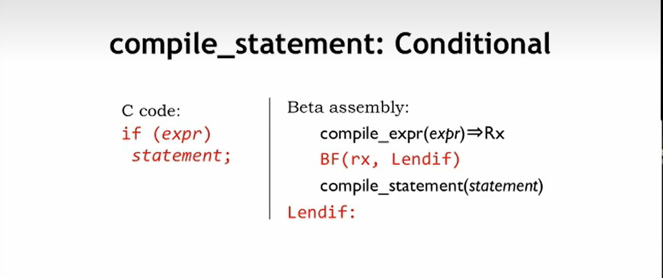
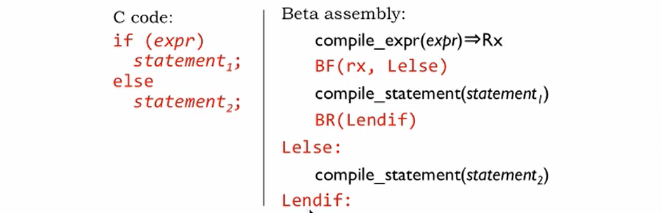
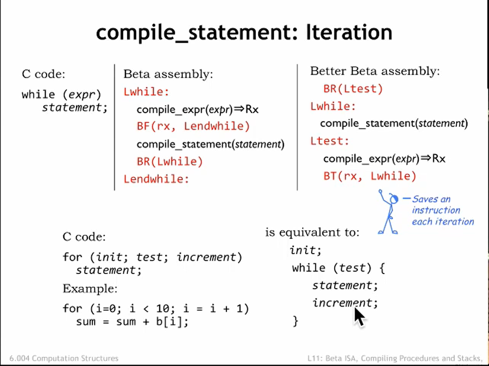

# L11_Procedures_And_Stacks

## 上节回顾


**编译过程**:
举例命令:y = (x-3)*(y+123456)
按照优先级,先计算左侧括号的表达式(x-3)中的x,将x保存到寄存器r1中
在计算(3)这个表达式,把它存到r2寄存器中
然后计算使用`SUB(r1,r2,r1)`计算(x-3),并将结果保存到r1寄存器中
同理在对公式右端进行计算,保证**以最少的寄存器完成任务**,具有很强的规律性.
`p.s`感觉这个过程有点像递归里面的压栈和出栈

## 编译表达式
上节课提到了编译的四种基本的表达式,接下来将会重点介绍四种表达式的实现方式
1. 顺序结构(无条件):
    直接调用compile_expr(expr)就能实现操作

2. 复合结构,进行一定顺序编译,把必要的结果一一放到寄存器中

3. 分支结构
    
    这是一个简单的分支结构,先计算条件,将其放入Rx寄存器中,之后使用`BF`判断条件是否成立,若不成立,跳转到`Lendif`处,成立的话编译if之中的表达式
    
    加入`else`以后也是一样的

4. 循环迭代结构
    
    这种结构和`if`的结构类似,判断条件是否成立,如果不成立就跳到`Lendwhile`处结束循环
    当然我们还能为其优化,可以先将条件初始化,然后在每次循环结束之后对条件进行更改,有点类似于`for`循环的结构

### 编译示例
```c
int n = 20;
int r = 0;
r = 1;
while(n>0){
    r = r*n;
    n = n-1;
}
```

```asm
n: LONG(20)
r: LONG(0)
start:
    CMOVE(1,r0)
    ST(r0,r)
    BR(test)
test:
    LD(n,r1)
    CMPLT(r31,r1,r2)
    BT(r2,loop)
loop:
    LD(r,r3)
    LD(n,r1)
    MUL(r1,r3,r3)
    ST(r3,r)
    LD(n,r1)
    SUBC(r1,1,r1)
    ST(r1,n)
done:
```

当然这样编译得到的结果是不完美的,因为在这个过程中进行了大量的LD,ST操作,没有完全利用寄存器资源,所以接下来我们将对其进行优化
```asm
n: LONG(20)
r: LONG(0)
start:
    CMOVE(1,r0)
    ST(r0,r)
    LD(n,r1)    //  初始化时先把n存在寄存器中,避免反复读取
    LD(r,r3)
    BR(test)
loop:
    MUL(r1,r3,r3)
    SUBC(r1,1,r1)
test:
    CMPLT(r31,r1,r2)
    BT(r2,loop)
done:
    ST(r1,n)    //  最后将结果存入内存中
    ST(r3,r)
```

## 程序和堆栈
### 调用自定义函数


