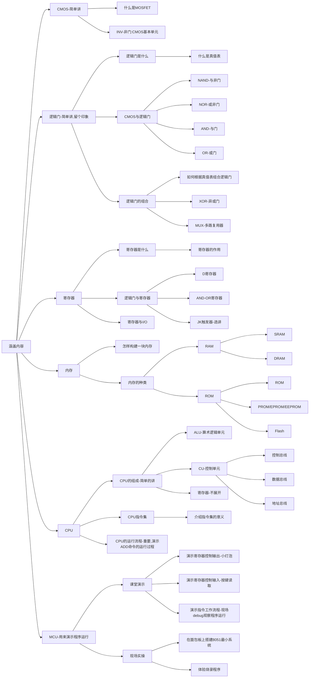

# Lecture2 The meaning of Abstraction

## 概要
在本节中,我们将会探讨硬件、操作系统、程序之间的关系,也会介绍连接他们三者的一种力量---**抽象**.
我们将从CMOS开始,一步步构建出一套完整的系统,形成对计算机科学的一个初步认知,对计算机祛魅.

使用Mermaid画出思维导图
## 涵盖内容
- CMOS(简单讲)
    - 什么是MOSFET
    - INV(非门):CMOS基本单元

- 逻辑门(简单讲,留个印象)
    - 逻辑门是什么
        - 什么是真值表
    - CMOS与逻辑门
        - NAND(与非门)
        - NOR(或非门)
        - AND(与门)
        - OR(或门)
    - 逻辑门的组合
        - 如何根据真值表组合逻辑门
        - XOR(异或门)
        - MUX(多路复用器)
        
- 寄存器
    - 寄存器是什么
        - 寄存器的作用
    - 逻辑门与寄存器
        - D寄存器
        - AND-OR寄存器
        - JK触发器 选讲
    - 寄存器与I/O

- 内存
    - 怎样构建一块内存
    - 内存的种类
        - RAM
            - SRAM
            - DRAM
        - ROM
            - ROM
            - PROM/EPROM/EEPROM
            - Flash

- CPU
    - CPU的组成(简单的讲)
        - ALU(算术逻辑单元)
        - CU(控制单元)
            - 控制总线
            - 数据总线
            - 地址总线
        - 寄存器(不展开)
    - CPU指令集
        - 介绍指令集的意义
    - CPU的运行流程(重要,演示ADD命令的运行过程)

- MCU(用来演示程序运行)
    - 课堂演示
        - 演示寄存器控制输出(小灯泡)
        - 演示寄存器控制输入(按键读取)
        - 演示指令工作流程(现场debug观察程序运行)
    - 现场实操
        - 在面包板上搭建8051最小系统
        - 体验烧录程序

