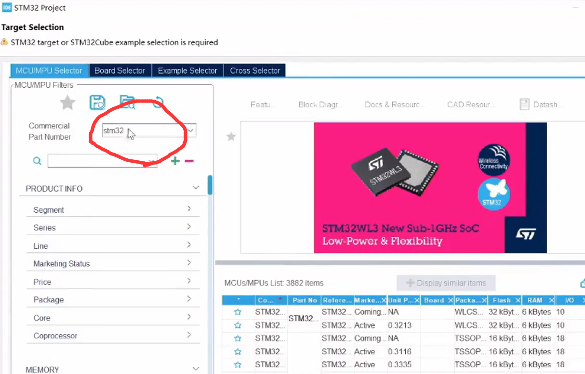
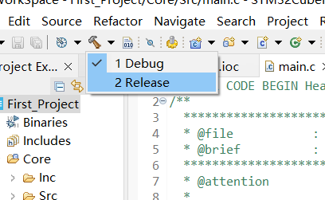

# CubeIDE使用说明(Part1)

## 新建工程

1. 设置工作空间

2. 创建工程

3. 找到对应的芯片型号

4. 设置工程名字

**这里直接点完成**

5. 设置HAL库

当出现这个标志时,你有两种解决方法
    1. 打开软件包管理
        
        
        
        登录你的账户,等待安装完成.
    2. 选择from Local进行安装
        [离线下载依赖包](https://blog.csdn.net/u014453443/article/details/125149315)

6. 设置GPIO引脚
    1. 找到引脚
    
    2. 选择引脚输出模式
    
    3. 更改GPIO设置
    
    4. 更改GPIO的详细参数
    
        1. GPIO Output Level:GPIO初始状态输出
        2. GPIO输出模式
        3. GPIO输出形式(Pullup,Pulldw,npunpd)
        4. GPIO时钟刷新速度
        5. User Label:用户定义标签
    5. RCC时钟配置
    
        1. 开启外部高速和低速时钟
            
        2. 进行时钟配置
            
            
                主频选取72MHZ,并选取外部高速时钟
        3.  进行调试配置
            
                这里选择Serial Wire.
7. 文件管理配置
    

8. 输出文件配置
    生成可用于串口发送接收的hex文件
    
    
    
    将模式改为Release时重复步骤8

## DAP&STLink调试
对于stlink来说,只需要安装好STLink驱动,便可以即开即用。
而对于DAP下载器来说，就可能需要一些额外的配置
### DAP调试器的配置
1. 

如果出现了如下的DAP调试器bug，不用怀疑，是ST公司动了手脚，需要我们自行配置openocd，解决方法如下
[解决方法](https://blog.csdn.net/lone5moon/article/details/124940297) 